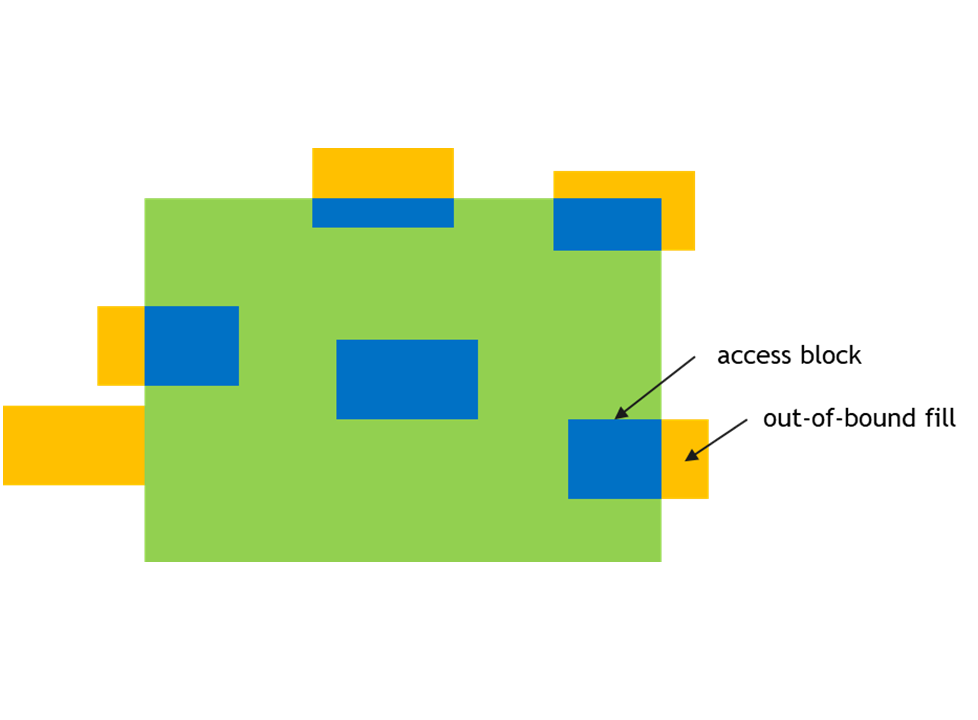

#### 5.5.3.3. Out of Boundary Access

PTX Tensor operation can detect and handle the case when the Bounding Box crosses the tensor boundary in any dimension. There are 2 modes:

  * Zero fill mode:

Elements in the Bounding Box which fall outside of the tensor boundary are set to 0.

  * `OOB-NaN` fill mode:

Elements in the Bounding Box which fall outside of the tensor boundary are set to a special NaN called `OOB-NaN`.

Figure 9 shows an example of the out of boundary access.

Figure 9 Out of boundary access
