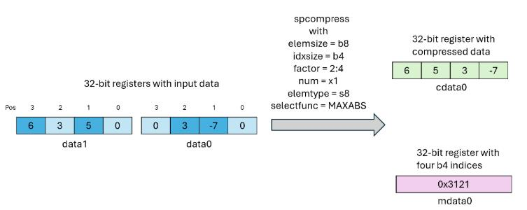

#### 9.7.10.30. Data Movement and Conversion Instructions: spcompress

`spcompress`

Compress dense vector to form structured sparse vector

Syntax

    spcompress.elemsize.idxsize.spfactor.num mdata, cdata, data, spdesc;
    
    .elemsize = { .b8, .b16 }
    .idxsize  = { .b2, .b4 }
    .spfactor = { .sp::2:4 }
    .num      = { .x1, .x2, .x4, .x8, .x16, .x32, .x64 }
    

Description

The `spcompress` instruction copies elements from a dense vector `data` to form the structured sparse compressed vector `cdata`. The resulting metadata is written to the vector operand `mdata`.

The compression factor is specified using quailfier `.spfactor`. The only allowed value for `.spfactor` is `.sp::2:4` resulting in 2:4 compression for a dense input vector. In this case, 2 elements per 4 group of elements from `data` would be selected and copied into `cdata`. The output vector `mdata` stores the indices for the chosen 2 elements per group of 4 elements. The criterion for selection of these elements is specified by a field from sparsity descriptor `spdesc`.

The qualifier `.elemsize` specifies the size in bits for each element from the input vector data. The exact data type for each element is specified by a field from sparsity descriptor `spdesc`. The qualifier `.idxsize` specifies the size of the metadata index for each selected element. Given the compression factor is 2:4, the `.idxsize` can only be `.b2` or `.b4`.

The `.num` qualifier depicts the repeat factor for the operation. The operands `data`, `cdata`, `mdata` are brace-enclosed vector expression consisting of one or more 32-bit registers. Any register overlap or otherwise register reuse among vector operands `data`, `cdata`, `mdata` results in undefined behavior. For the `data` and `cdata` operands, vector size depends on `.num` qualifier. For the `mdata` operand, the vector size depends on the `.num`, `.idxsize`, `.elemsize` qualifier values. For instance, when `.num` qualifier is specified as `.x1`, the operand `data` must comprise of 2 `.b32` registers while the resulting `cdata`, `mdata` are vector operands with singleton `.b32` register each. Similarly, when `.num` is set to `.x64`, the input operand `data` is a vector of 128 `.b32` registers while the resulting `cdata` comprises of 64 `.b32` registers. The expected vector size for each of the operand can be computed based on the Table 37. Note that the total vector size of all operands should not exceed 253. i.e. `vecSize(data) + vecSize(cdata) + vecSize(mdata) <= 253`.

Table 37 Expected vector size for various operands Operand | Vector Size  
---|---  
`data` | `2 * num`  
`cdata` | `num`  
`mdata` | `ceil(num * idxsize / elemsize)`

The 32-bit register operand `spdesc` is the instruction descriptor argument. The instruction descriptor encodes the exact data type for the input elements in `data` operand. It also specifies the operation that needs to be applied to select 2 elements per group of 4 elements. The Table 38 lists the exact layout for the descriptor argument `spdesc`.

Table 38 Instruction descriptor format Bits | Size | Description | Values  
---|---|---|---  
0-1 | 2 | These bits represent the operation that needs to be used in the selection of 2 elements per group of 4 elements. MAX and MIN will select the two elements with the greatest and smallest values respectively. Whereas MAXABS and MINABS will select the two elements with the greatest and smallest magnitude respectively. | 0: MAX, 1: MAXABS, 2: MIN, 3: MINABS  
2-4 | 3 | These bits represent the data type of elements from source operand `data`. When set to either 0 or 1, the `.elemsize` qualifier on the instruction helps to uniquely identify the exact type. Inconsistent setting of these bits with respect to `.elemsize` qualifier would result in runtime error. | 0: `.f16`/`.u8`, 1: `.bf16`/`.s8`, 2: `.e5m2`, 3: `.e4m3`, 4: `.e3m2`, 5: `.e2m3`  
5-31 | 26 | Reserved | 0

Figure 43 shows pictorial representation of a simple `spcomress` instruction.

  
  
Figure 43 Illustration for spcompress instruction.

Notes

  * The operation treats `-0.0` < `+0.0`.

  * When metadata information is smaller than 32-bits, zero extension is applied to fit it within 32-bit `mdata` operand.

  * A group of 4 elements may have three or more elements satisfying the comparison operation. Similarly, two or more elements may classify as second largest/smallest value. In such cases, which values will have their indices represented in the output is implementation-specific.

  * `NaN` values in the input will always have their indices produced in the output. For example, an input with 2 `NaN` values in a group of 4 elements will produce the indices of two of those `NaN` in the output. An input with three or more `NaN` values in a group will produce two `NaN` in the output however which `NaN` values will have their indices represented in the output is implementation-specific.

PTX ISA Notes

Introduced in PTX ISA version 9.4

Target ISA Notes

Supported on following architectures:

  * `sm_107a`

Example

    .reg .b32 mdata_<2>, cdata_<4>, data_<8>, spdesc;
    mov.b32 spdesc, 0x5; // MAXABS op, .s8 datatype
    spcompress.b8.b2.sp::2:4.x4 {mdata_0},
       {cdata_0, cdata_1, cdata_2, cdata_3},
       {data_0, data_1, data_2, data_3, data_4, data_5, data_6, data_7},
       spdesc;
