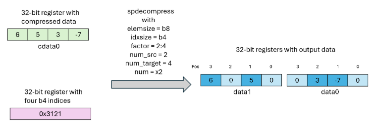

#### 9.7.10.31. Data Movement and Conversion Instructions: spdecompress

`spdecompress`

Decompress structured sparse vector to form dense vector

Syntax

    spdecompress.elemsize.idxsize.spfactor.num data, mdata, cdata;
    
    .elemsize  = { .b8, .b16 }
    .idxsize   = { .b2, .b4 }
    .spfactor  = { .sp::1:2, .sp::1:4, .sp::1:8, .sp::1:16,
                   .sp::2:4, .sp::2:8, .sp::2:16,
                   .sp::4:8, .sp::4:16 }
    .num       = { .x1, .x2, .x4, .x8, .x16, .x32, .x64 }
    

Description

The `spdecompress` instruction copies elements from structured sparse compressed vector `cdata` to form the dense vector `data`. The metadata information corresponding to the structured sparse compressed vector `cdata` is given by the vector operand `mdata`.

The decompression factor is derived from the qualifier `.spfactor`. The qualifier is of form `.sp::num_src:num_target` implying instruction decompresses each sequence of `num_src` elements so as to form the sequence comprising num_target many elements. Given decompress operation, it naturally follows that the `num_src` value must be strictly numerically smaller than the `num_target` value.

The `spdecompress` instruction copies each element out of a sequence of `num_src` elements from `cdata` so as to transform it into a sequence of `num_target` elements in the resulting `data` operand. The target index corresponding to the each element of `num_src` sequence is given by `mdata` operand. If no element from `num_src` sequence is copied to a position within a sequence of `num_target` elements, then that position is set to zero. Similarly, all empty and unpopulated bits of the output operand `data` are set to zero.

The `.num` qualifier depicts the repeat factor for the operation. The size of target index per element is specified by `.idxsize`. The qualifier `.elemsize` depicts size of each element belonging to the sequence of `num_src` and `num_target`. The operands `mdata`, `cdata` and `data` are brace-enclosed vector expression consisting of one or more `.b32` registers. Any register overlap or otherwise register reuse among vector operands `mdata`, `cdata`, `data` results in undefined behavior. The vector size for each of the operand depends on the qualifier values. The expected vector size for each of the operand can be computed based on the Table 39.

Table 39 Expected vector size for various operands Operand | Vector Size  
---|---  
`mdata` | `ceil(num_src * idxsize * num / 32)`  
`cdata` | `ceil(num_src * elemsize * num / 32)`  
`data` | `ceil(num_target * elemsize * num / 32)`

The following conditions must be satisfied for a valid `spdecompress` instruction:

  * The input span corresponding to single iteration of `.num` qualifier must fit within a single `.b32` register. i.e. `num_src * .elemsize <= 32`.  
  
  * The `.idxsize` should be sufficient to fully index into the sequence of `num_target` elements. In other words, if `.idxsize` is `.b2` then `num_target` must be `<= 4`.

  * The size of the data operand should be at least 1. i.e. `num_target * .elemsize * .num >= 32`.

  * The size of the data operand can be at most 128. i.e. `num_target * .elemsize * .num <= 4096`.

  * The total vector size of all operands should not exceed 253. i.e. `vecSize(mdata) + vecSize(cdata) + vecSize(data) <= 253`.

Figure 44 shows pictorial representation of a simple `spdecompress` instruction.

Figure 44 Illustration for spdecompress instruction.

Semantics

    for N in .num:
       for S in num_source:
          data[mdata[N][S]] = cdata[N][S];
    

Notes

If any of the metadata indices from `mdata` operand happen to be larger than the `num_target` value derived out of the decompression factor then the behavior is implementation-specific.

PTX ISA Notes

Introduced in PTX ISA version 9.4

Target ISA Notes

Supported on following architectures:

  * `sm_107a`

Example

    .reg .b32 mdata_<4>, cdata_<32>, data_<32>;
    
    spdecompress.b8.b2.sp::2:4.x32 {data_0, data_1, data_2, data_3, data_4, data_5, data_6, data_7, data_8,
                                    data_9, data_10, data_11, data_12, data_13, data_14, data_15, data_17,
                                    data_18, data_19, data_20, data_21, data_22, data_23, data_24, data_25,
                                    data_26, data_27, data_28, data_29, data_30, data_31},
                                   {mdata_0, mdata_1, mdata_2, mdata_3},
                                   {cdata_0, cdata_1, cdata_2, cdata_3, cdata_4, cdata_5, cdata_6, cdata_7,
                                    cdata_8, cdata_9, cdata_10, cdata_11, cdata_12, cdata_13, cdata_14, cdata_15};
