#### 9.7.18.10. TensorCore 5th Generation Matrix Multiply and accumulate Operations

The 5th generation of TensorCore operations of shape _MxNxK_ perform matrix multiplication and accumulation of the form:

`D = A*B+D`

where:

  * the `A` matrix has shape _MxK_ , in either Tensor Memory or Shared Memory

  * the `B` matrix has shape _KxN_ , in Shared Memory of the current CTA and optionally in peer CTA

  * the `D` matrix is of the shape _MxN_ , in Tensor Memory

Optionally an input predicate can be used to disable the input from the accumulator matrix and the following operation can be performed as

`D = A*B`

The matrix multiplication and accumulation operations are categorized into various kinds based on input types and the throughput of the multiplication operation. The following shows the different kinds of MMA operations that are supported:

  1. `f16` : supports `f16` and `bf16` input types.

  2. `tf32` : supports `tf32` input types.

  3. `f8f6f4` : supports all input combinations of `f8`, `f6` and `f4` types.

  4. `i8` : supports signed and unsigned 8-bit integer input types.

  5. `mxf8f6f4`/`mxf4` : supports mx-floating points input types.

  6. `mxf4nvf4` : supports `mxf4` type and a custom NVIDIA floating-point type for inputs where the type of the vector elements is 4 bits and requires a common scaling factor to form the complete floating-point type, similar to other mx-types.

Optionally, the 5th generation of TensorCore MMAs support dense and sparse matrix `A`. Sparse Matrices describes the details of the sparse matrices.

Some of the MMA-kinds requires scaling of input matrices from memory to form the matrix `A` and matrix `B` before performing the MMA operation. Block Scaling for tcgen05.mma describes the details of the scaling of matrices.

The following table show the various matrices involved in the MMA operations and the memory in which they can reside:

Matrix Type | Memory  
---|---  
`A` | Tensor Memory OR Shared Memory  
`B` | Shared Memory  
`D` | Tensor Memory  
`Sparse Meta Data`  
`A-Scale` / `B-Scale`  
`B` Lookup Metadata | Tensor Memory, needs `B` to be in Shared Memory

A sequence of MMA instructions may reuse the same `A` matrix with a sequence of `B` matrices or may reuse the same `B` matrix with a sequence of `A` matrices. In these patterns the TensorCore may be able to load the unchanged matrix once and reuse it through the sequence without multiple reloads. The `A` or `B` matrices are loaded into a TensorCore collector buffer (i.e., special cache).

An MMA instruction has an optional `collector` qualifier to specify when an `A` or `B` matrix is new to the sequence and should be loaded, unchanged within the sequence and should be reused, or the last use in the sequence and should be discarded. The `collector` qualifier is used to give the TensorCore permission to reuse a previously loaded `A` or `B` matrix; however reuse is opportunistic in that the TensorCore may reload a matrix even when it has permission to reuse that matrix. Thus, the source memory of an `A` or `B` matrix must not be modified while the MMA instruction using those matrices has not completed - regardless of `collector` qualifier permissions.

The 5th generation of TensorCore MMAs can be used for general matrix multiplication OR for convolution operations. In case of convolutions, the activations can be stored in either matrix `A` or matrix `B` while the weights will be stored in the other matrix.

Activation Matrix | Weights Matrix | Name of the op | Instruction Name | Collector Buffer Applicability  
---|---|---|---|---  
`A` | `B` | Activation Stationary | (default `tcgen05.mma`) | Collector buffer is applicable on matrix `A`  
`B` | `A` | Weights Stationary | `.ws` | Collector buffer is applicable on matrix `B`

#####  9.7.18.10.1. Transpose and Negate operations  
  
The matrices `A` and `B` can be transposed by specifying the Transpose `A` Matrix and Transpose `B` Matrix bits in the instruction descriptor respectively.

The elements of the matrices `A` and `B` can be negated by specifying the Negate `A` Matrix and Negate `B` Matrix bits in the instruction descriptor respectively.

The support for Transpose and Negate operation for various MMA-Kind are shown in Table 62.

Table 62 Transpose and Negate operation for various MMA-Kind MMA-Kind | Is Transpose A/B supported | Is Negate A/B supported  
---|---|---  
`.kind::tf32` | Yes | Yes  
`.kind::f16` | Yes | Yes  
`.kind::ti16` | Yes | Yes  
`.kind::f8f6f4` | 

  * No for matrix `B` with `decpmpress::lut::b`
  * No for element types `E3M2`, `E2M3` and `E2M1` for Dense matrix with K = 64
  * Yes for all other cases

| Yes  
`.kind::mxf8f6f4` | 

  * No for matrix `B` with `decpmpress::lut::b`
  * No for element types `E3M2`, `E2M3` and `E2M1` for Dense matrix with K = 64
  * Yes for all other cases

| Yes  
`.kind::i8` | Yes | No  
`.kind::mxf4` | No | Yes  
`.kind::mxf4nvf4` | No | Yes  
  
For `.kind::tf32`, the transpose operations on matrices `A` and `B` are supported only with 128B swizzling mode with 32B swizzle-atomicity.

For all other MMA-Kinds, the transpose operations on matrices `A` and `B` are not supported on 128B swizzling mode with 32B swizzle-atomicity.

Table 63 shows the valid combinations of N shape with `.cta_group` qualifier for 8bit transpose B.

Table 63 Various combinations of N shape with .cta_group qualifier for 8bit transpose B .cta_group | N shape  
---|---  
1 | 16 <= N <= 256, step 16  
2 | 32 <= N <= 256, step 32

#####  9.7.18.10.2. Matrix Layout Organization  
  
Table 64 describes the major-ness used for different matrices.

Table 64 Major-ness for different matrices Matrix | Residing in Memory | Default Major-ness  
---|---|---  
D | Tensor Memory | Row-Major  
A | Tensor Memory  
Shared Memory | Depends on swizzling mode. Refer Shared Memory Layout and Swizzling  
B | Shared Memory

#####  9.7.18.10.3. Valid Combinations of Type-Size, Major-ness and Swizzling  
  
Table 65 Valid Combinations of Type-Size, Major-ness and Swizzling Type-Size | Major-ness | Matrix | Supported Swizzle  
---|---|---|---  
4-bit, 6-bit, 8-bit, 16-bit, 32-bit | Row | A | All swizzling modes  
Column | B  
8-bit 16-bit | Column (transpose) | A | All except 128B swizzling with 32B atomicity  
Row (transpose) | B  
32-bit | Column (transpose) | A | Only 128B swizzling with 32B atomicity  
Row (transpose) | B

#####  9.7.18.10.4. Packing formats of elements in Tensor and Shared memory  
  
######  9.7.18.10.4.1. Packing format for matrix D in Tensor Memory

The sub-word elements of matrix `D` are expected not to be packed within a 32-bit Tensor Memory word. For example, if the type of elements of the matrix `D` is 16 bits then a Tensor Memory word would contain a single 16-bit element in its lower 16 bits.

######  9.7.18.10.4.2. Packing format for matrix A and B

The 6-bit and 4-bit floating point types have different packing format requirements for different MMA kinds in both Tensor memory and Shared memory. The requirements are as follows.

######  9.7.18.10.4.3. Packing format used for matrix A by `.kind::mxf8f6f4` in Tensor Memory

The supported combination of the container size and the individual floating point type elements supports are listed in Table 66

Table 66 Valid Combinations of Container size and floating point types Individual floating point type element | Container size | Dense K dimension (number of elements)  
---|---|---  
FP4 | 8-bits | 32  
FP6 | 6-bits | 64  
8-bits (with 2-bits padding in each byte) | 32  
FP8 | 8-bits | 32  
  
The 8-bit or 6-bit containers must be contiguously packed in a 32-bit Tensor Memory word. For example, if the type of elements of the matrix `A` is 6 bits and uses 8-bit container then 4 consecutive `A` elements should be packed in one 32-bit Tensor Memory word.

  * 4-bit packing format in an 8-bit container as shown in Figure 202

Figure 202 4-bit packing format with type E2M1

  * 6-bit packing format in an 8-bit container

    * Type E3M2 as shown in Figure 203

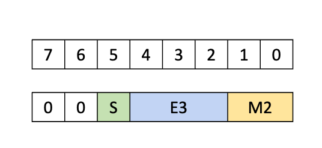

Figure 203 6-bit packing format in an 8-bit container with type E3M2

    * Type E2M3 as shown in Figure 204

Figure 204 6-bit packing format in an 8-bit container with type E2M3

  * 6-bit packing format in an 6-bit container

    * Type E3M2 as shown in Figure 205

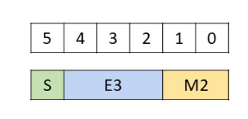

Figure 205 6-bit packing format in an 6-bit container with type E3M2

    * Type E2M3 as shown in Figure 206

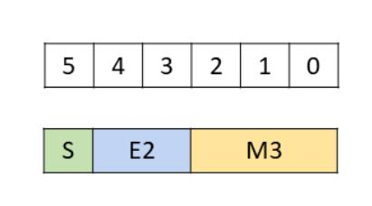

Figure 206 6-bit packing format in an 6-bit container with type E2M3

######  9.7.18.10.4.4. Packing format used for matrix A and B by `.kind::mxf8f6f4` in Shared Memory

The 4-bit and 6-bit floating point elements in shared memory must be contiguously packed and based on the Dense-K dimension, padding may be needed:

Dense-K dimension | Padding needed after 16 elements  
---|---  
32 | Yes  
64 | No  
  
  * 4-bit packing format with padding as shown in Figure 207

Figure 207 4-bit packing format with padding

  * 6-bit packing format with padding as shown in Figure 208

> 
> 
> Figure 208 6-bit packing format with padding

  * 6-bit packing format without padding as shown in Figure 209

> 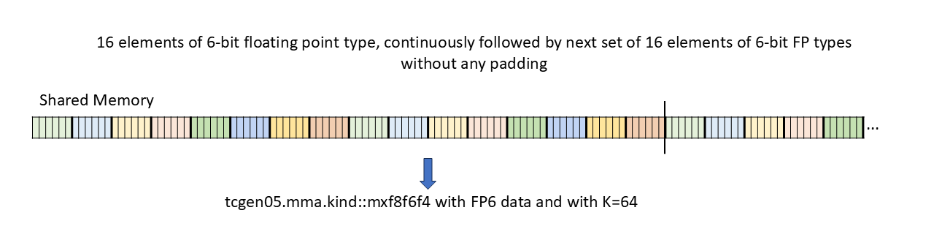
> 
> Figure 209 6-bit packing format without padding

######  9.7.18.10.4.5. Packing format used for matrix A by `.kind::mxf4` and `.kind::mxf4nvf4` in Tensor Memory

Two 4-bit floating point type elements must be packed in an 8-bit container in Tensor memory as shown in Figure 210 for `mxf4`.

Figure 210 4-bit packing format with type E2M1

######  9.7.18.10.4.6. Packing format used for matrix A and B by `.kind::mxf4` and `.kind::mxf4nvf4` in Shared Memory

The packing format for 4-bit floating point elements in shared memory is to pack two 4-bit elements in a 8-bit container, with no padding.

#####  9.7.18.10.5. Data Path Layout Organization

Different MMA variants access the tensor memory with different layout organization. The following table lists the various layouts:

M | cta_group | A-Sparsity | Is .ws mode | Datapath organization | Layout ID | Tensor Memory Datapath Lane Alignment  
---|---|---|---|---|---|---  
32 | ::1 | Either | Yes | 1x4 | Layout G | 0  
64 | ::1 | Either | Yes | 2x2 | Layout E | 0  
64 | ::1 | Either | No | 4x1 (1/2 datapath utilized) | Layout F | 0 or 16  
128 | ::1 | Either | Either | 4x1 | Layout D | 0  
128 | ::2 | Dense | N/A | 2x2 | Layout B | 0  
128 | ::2 | Sparse | N/A | 4x1 (1/2 datapath utilized) | Layout C | 0 or 16  
256 | ::2 | Either | N/A | 4x1 | Layout A | 0  
  
The layouts which utilize only half the datapath lanes, i.e., Layout F and Layout C, must use the same Tensor Memory lane alignment across matrices `A`, `D` and the sparsity metadata matrix.

The following shows the warps that can access the Tensor Memory regions via `tcgen05.ld` / `tcgen05.st` along with the addresses for various Tensor Memory Layouts.

######  9.7.18.10.5.1. Layout A (M = 256)

Layout organization for M = 256 is shown in Figure 211.

Figure 211 Layout organization for M = 256

Addresses for the above region to be used in `tcgen05.ld` / `tcgen05.st` is shown in Figure 212

Figure 212 Addresses to use in `tcgen05.ld` / `tcgen05.st`

######  9.7.18.10.5.2. Layout B (M = 128 + cta_group::2 + Dense A matrix)

Layout organization for M = 128 + .cta_group::2 + Dense A matrix is shown in Figure 213.

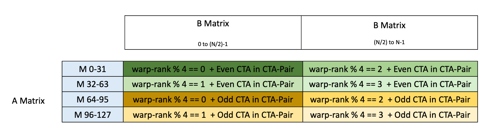

Figure 213 Layout organization for M = 128 + .cta_group::2 + Dense A matrix

Addresses for the above region to be used in `tcgen05.ld` / `tcgen05.st` is shown in Figure 214

Figure 214 Addresses to use in `tcgen05.ld` / `tcgen05.st`

######  9.7.18.10.5.3. Layout C (M = 128 + cta_group::2 + Sparse A matrix)

Layout organization for M = 128 + .cta_group::2 + Sparse A matrix is shown in Figure 215.

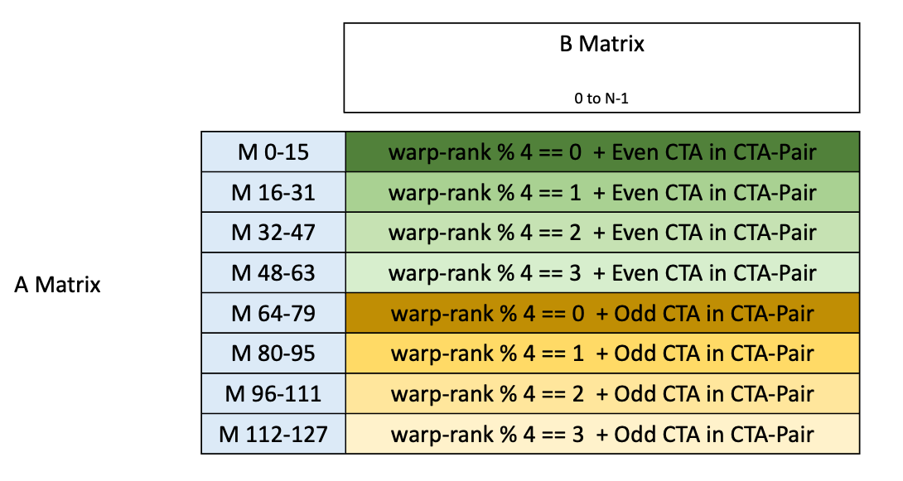

Figure 215 Layout organization for M = 128 + .cta_group::2 + Sparse A matrix

Addresses for the above region to be used in `tcgen05.ld` / `tcgen05.st` is shown in Figure 216

Figure 216 Addresses to use in `tcgen05.ld` / `tcgen05.st`

######  9.7.18.10.5.4. Layout D (M = 128 + cta_group::1)

Layout organization for M = 128 + .cta_group::1 is shown in Figure 217.

Figure 217 Layout organization for M = 128 + .cta_group::1

Addresses for the above region to be used in `tcgen05.ld` / `tcgen05.st` is shown in Figure 218

Figure 218 Addresses to use in `tcgen05.ld` / `tcgen05.st`

######  9.7.18.10.5.5. Layout E (M = 64 + .ws mode)

Layout organization for M = 64 + .ws mode is shown in Figure 219.

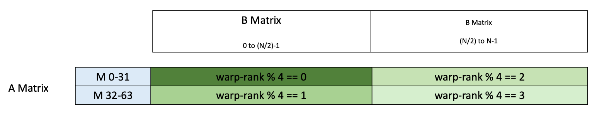

Figure 219 Layout organization for M = 64 + .ws mode

Addresses for the above region to be used in `tcgen05.ld` / `tcgen05.st` is shown in Figure 220

Figure 220 Addresses to use in `tcgen05.ld` / `tcgen05.st`

######  9.7.18.10.5.6. Layout F (M = 64 + non .ws mode)

Layout organization for M = 64 + non .ws mode is shown in Figure 221.

Figure 221 Layout organization for M = 64 + non .ws mode

Addresses for the above region to be used in `tcgen05.ld` / `tcgen05.st` is shown in Figure 222

Figure 222 Addresses to use in `tcgen05.ld` / `tcgen05.st`

######  9.7.18.10.5.7. Layout G (M = 32)

Layout organization for M = 32 is shown in Figure 223.

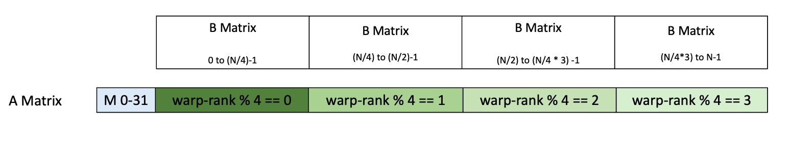

Figure 223 Layout organization for M = 32

Addresses for the above region to be used in `tcgen05.ld` / `tcgen05.st` is shown in Figure 224

Figure 224 Addresses to use in `tcgen05.ld` / `tcgen05.st`

#####  9.7.18.10.6. Shared Memory Layout and Swizzling

If the bit `Transpose A Matrix` / `Transpose B Matrix` in the Instruction descriptor is 0, then _K-major_ is used for matrix `A` / `B` respectively. If the bit `Transpose A Matrix` in the Instruction descriptor is 1 then _M-major_ is used for matrix `A`. If the bit `Transpose B Matrix` in the Instruction descriptor is 1, then _N-major_ is used for matrix `B`.

In a column-major default BLAS library such as cuBLAS, the matrices `A` and `B` with and without transpose can be classified as either _K-Major_ or _M-or-N-Major_ as shown in the following table:

| Non-Transposed | Transposed  
---|---|---  
A | K-major | M-major  
B | K-major | N-major  
  
To avoid confusion with `A`, `B`, `row-major`, `col-major`, `transpose`, and `non-transpose`, we will use _MN-Major_ and _K-Major_ throughout this section.

The matrices in the shared memory are made up of one or more “swizzle layout atom”. The exact layout of these swizzle atoms depends on the swizzling mode, swizzle-atomicity, and the leading dimension. The layout of the swizzle are shown in Table 67

Table 67 Layout for swizzle atoms Swizzling mode and Swizzle-Atomicity | Leading Dimension | Swizzle atom layout (128b element)  
---|---|---  
128B Swizzling with 32B atomicity | M/N | 8x4  
– | –  
128B Swizzling with 16B atomicity | M/N | 8x8  
K | 8x8  
64B Swizzling Mode | M/N | 4x8  
K | 8x4  
32B Swizzling Mode | M/N | 2x8  
K | 8x2  
None | M/N | 1x8  
K | 8x1  
  
The above shapes are for elements of size 128 bits. For smaller element sizes, the same shapes would get multiplied along the leading dimension by a factor of `128 / sizeof_bits(Element)`. For example, 128B MN major swizzle atom would have a shape of (8*(128/32))x8 = 32x8 for tf32 tensor core inputs.

Some example Layouts of _MxK_ or _KxN_ matrices with various swizzling modes, and are in units of 128b elements as shown by each colored cell as shown in Figure 225, Figure 226, Figure 227, Figure 228, Figure 229, Figure 230, Figure 231, Figure 232, Figure 233.

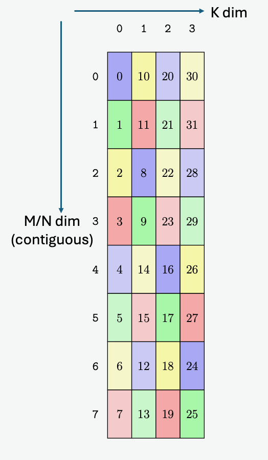

Figure 225 MN major 128B swizzling with 32B atomicity

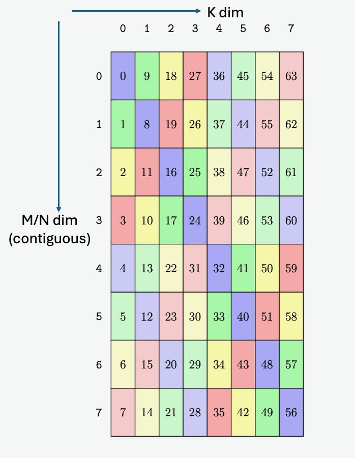

Figure 226 MN major 128B swizzling

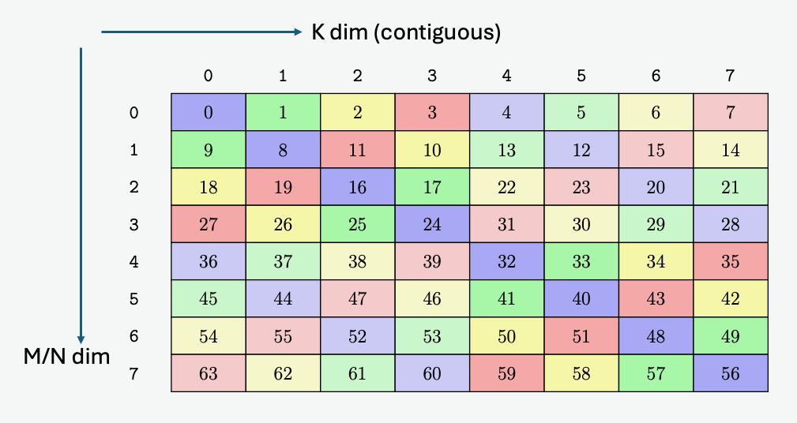

Figure 227 K major 128B swizzling

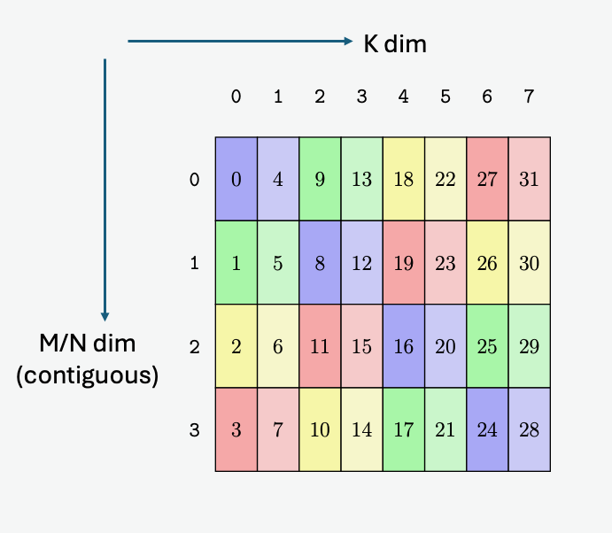

Figure 228 MN major 64B swizzling

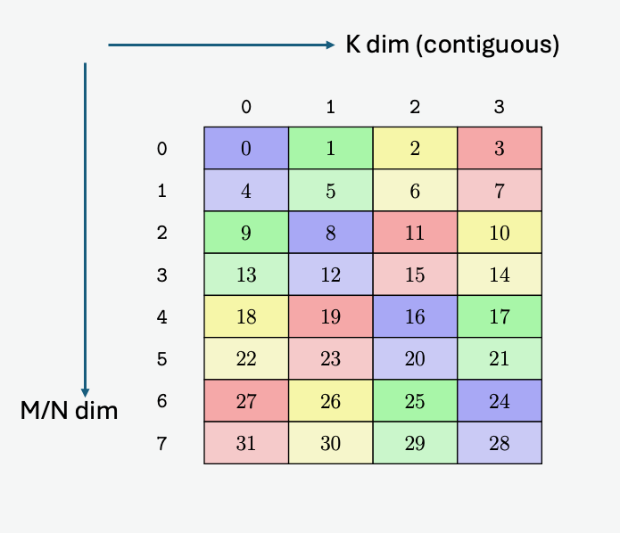

Figure 229 K major 64B swizzling

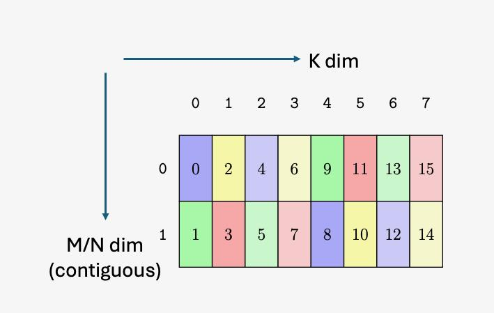

Figure 230 MN major 32B swizzling

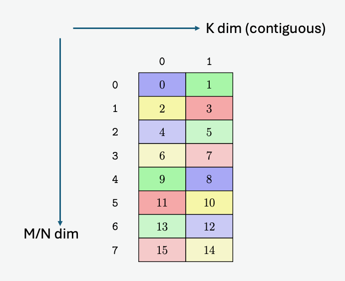

Figure 231 K major 32B swizzling

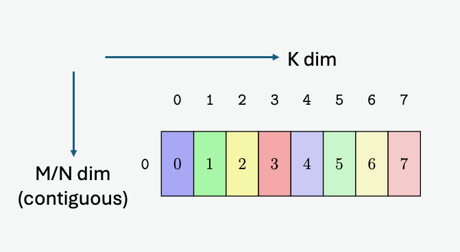

Figure 232 MN major no-swizzling mode

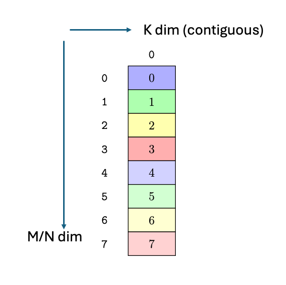

Figure 233 K major no-swizzling mode

Following are some of the examples of the 128B swizzling layout for `tf32` element type.

  * K-Major: Figure 234

> 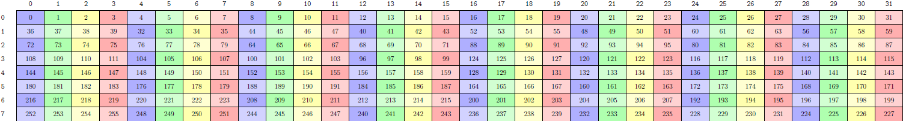
> 
> Figure 234 K major

  * MN-Major: Figure 235

> 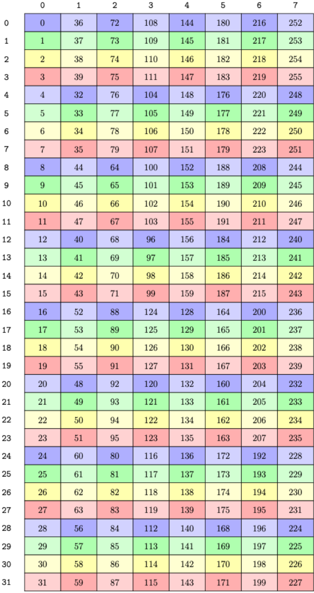
> 
> Figure 235 MN major

#####  9.7.18.10.7. Block Scaling for `tcgen05.mma`

The `tcgen05.mma` instructions with the following `.kind` qualifier:

  * `.kind::mxf8f6f4`

  * `.kind::mxf4`

  * `.kind::mxf4nvf4`

perform matrix multiplication with block scaling. This operation has the following form:

`(A * scale_A) * (B * scale_B) + D`

where `scale_A` and `scale_B` are matrices residing in Tensor Memory.

For a `scale_A` matrix of shape _M x SFA_N_ , each row of matrix `A` is divided into _SFA_N_ number of chunks and each chunk of a row is multiplied with the corresponding element in the _SF_A_ of the same row.

Similarly, for a `scale_B` matrix of shape _SFB_M x N_ , each column of matrix `B` is divided into the _SFB_M_ number of chunks and each chunk of a column is multiplied with the corresponding element in the _SF_B_ of the same column.

Scale factor for `B` matrix needs to be duplicated to all 32 lane partitions of tensor memory. But for the `A` matrix, the duplication is not necessary if the scales are copied into Tensor Memory via tcgen05.st on `sm_107f` architecture.

Figure 236 shows an example of `tcgen05.mma` with block scaling of `scale_vec::2X`.

Figure 236 `tcgen05.mma` with block scaling of `scale_vec::2X`

######  9.7.18.10.7.1. Valid combinations of scale_vectorsize with types and MMA-Kind

The shape of _scale_A_ and _scale_B_ matrices depend on the `.scale_vectorsize` as shown in Table 68.

Table 68 Valid combinations of scale_vectorsize and shapes .scale_vectorsize | .kind::* | K | Shape of scale_A | Shape of scale_B  
---|---|---|---|---  
`.scale_vec::1X` | `.kind::mxf8f6f4` | All supported values of K | M x 1 | 1 x N  
`.scale_vec::2X` | `.kind::mxf4`, `.kind::mxf4nvf4` | All supported values of K | M x 2 | 2 x N  
`.scale_vec::4X` | `.kind::mxf4nvf4` | All supported values of K | M x 4 | 4 x N  
`.block16` | `.kind::mxf4nvf4` | K = 96 | M x 6 | 6 x N  
K = 128 | M x 8 | 8 x N  
All supported values of K except 96 | M x 4 | 4 x N  
`.block32` | `.kind::mxf4`, `.kind::mxf4nvf4` | K = 96 | M x 3 | 3 x N  
K = 128 | M x 4 | 4 x N  
All supported values of K except 96 | M x 2 | 2 x N  
`.kind::mxf8f6f4` | All supported values of K | M x 1 | 1 x N  
  
The valid combination of the exact element types and the `.scale_vectorsize` are listed in Table 69.

Table 69 Valid combinations of scale_vectorsize with types and MMA-Kind .kind::* | Element Data Type | Scale Data Type | .scale_vectorsize  
---|---|---|---  
`.kind::mxf8f6f4` | E4M3, E5M2, E2M3 E3M2, E2M1 | UE8M0 | `.scale_vec::1X` / `.block32`  
`.kind::mxf4` | E2M1 | UE8M0 | `.scale_vec::2X` / `.block32`  
`.kind::mxf4nvf4` | E2M1 | UE8M0 | `.scale_vec::2X` / `.block32`, `.scale_vec::4X` / `.block16`  
E2M1 | UE4M3 | `.scale_vec::2X` / `.block32`, `.scale_vec::4X` / `.block16`  
E2M1 | UE5M3 | `.scale_vec::2X` / `.block32`, `.scale_vec::4X` / `.block16`  
  
New `.blockN` qualifiers are aliases for `.scale_vec::NX` qualifiers as:

  * `.block32` is alias for `.scale_vec::1X` or `.scale_vec::2X` based on `.kind` and K dimension

  * `.block16` is alias for `.scale_vec::4X`

Target ISA Note

  * Support for scale type `UE5M3` requires target architecture `sm_107f` or higher in the same family, otherwise behavior is undefined.

  * Support for scale type `UE4M3` with scale_vectorsize `.block32` requires target architecture `sm_107f` or higher in the same family, otherwise behavior is undefined.

######  9.7.18.10.7.2. Scale Factor A ID

The value of the scale factor `A ID` selects the sub-columns in the Tensor Memory to form the scale factor `A` matrix, which is used to scale the matrix `A`.

The following shows the scale factor matrix layout for various scale vector sizes:

####### 9.7.18.10.7.2.1. Layout of the Scale Factor A Matrix for scale_vec::1X/block32 with K=32/K=64

There is one scale factor per row of the `A` matrix with block size as 32 and the scale factor must be provided in 1-byte aligned sub-column of the Tensor Memory. _SFA_ID_ specifies the byte offset in the Tensor Memory word that must be used for the scale factor matrix. Figure 237 shows which sub-columns get selected for different values of _SFA_ID_.

Figure 237 Layout of scale factor A matrix with scale_vec::1X/block32 with K=32/K=64

For example, if _SFA_ID_ is 0, then all the green columns are selected to form the scale factor matrix. Similarly, _SFA_ID_ values of 1, 2 and 3 would select the blue, yellow, and red columns, respectively.

Figure 238 shows the scale factor `A` matrix layout with 128 lanes which is supported on `sm_107f` architecture. Valid values of subp here are [0, 3];

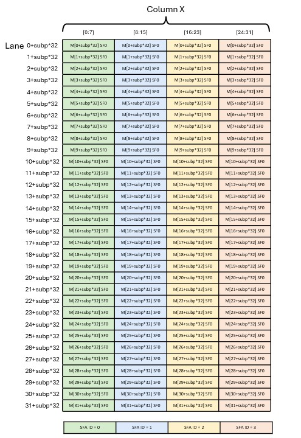

Figure 238 Layout of scale factor A matrix with scale_vec::1X/block32 with K=32/K=64 with 128 lanes

####### 9.7.18.10.7.2.2. Layout of the Scale Factor A Matrix for scale_vec::2X/block32 with K=64/K=128

There are two scale factors per row of the `A` matrix with block size as 32 and the scale factor must be provided in 2-byte aligned sub-column of the Tensor Memory. _SFA_ID_ specifies the half word offset in the Tensor Memory word that must be used for the scale factor matrix. Figure 239 shows which sub-columns get selected for different values of _SFA_ID_.

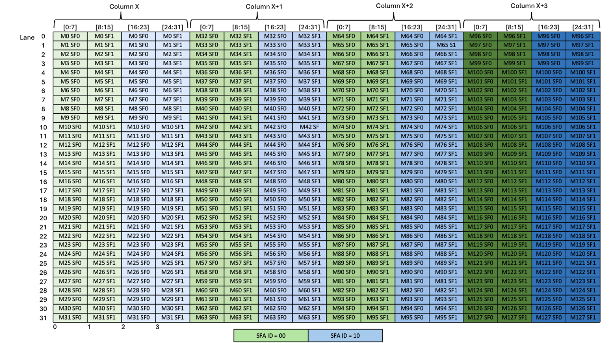

Figure 239 Layout of scale factor A matrix with scale_vec::2X/block32 with K=64/K=128

For example, if _SFA_ID_ is 0, then all the green columns are selected to form the scale factor matrix. Similarly, if _SFA_ID_ is 2, then all of the blue columns are selected to form the scale factor matrix.

Figure 240 shows the scale factor `A` matrix layout with 128 lanes which is supported on `sm_107f` architecture. Valid values of subp here are [0, 3];

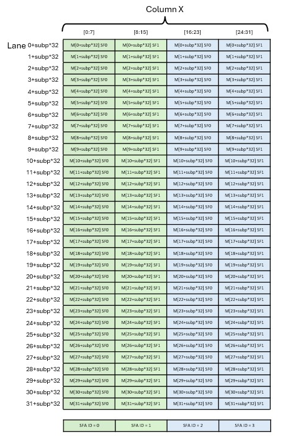

Figure 240 Layout of scale factor A matrix with scale_vec::2X/block32 with K=64/K=128 with 128 lanes

####### 9.7.18.10.7.2.3. Layout of the Scale Factor A Matrix for scale_vec::4X/block16 with K=64/K=128

There are four scale factors per row of the `A` matrix with block size as 16 and the scale factor must be provided in 4-byte aligned sub-column of the Tensor Memory. The _SFA_ID_ value must be 0 and this specifies that all of the columns (in green) will be used for the scale factor matrix. Figure 241 shows which sub-columns get selected for different values of _SFA_ID_.

Figure 241 Layout of scale factor A matrix with scale_vec::4X/block16 with K=64/K=128

Figure 242 shows the scale factor `A` matrix layout with 128 lanes which is supported on `sm_107f` architecture. Valid values of subp here are [0, 3];

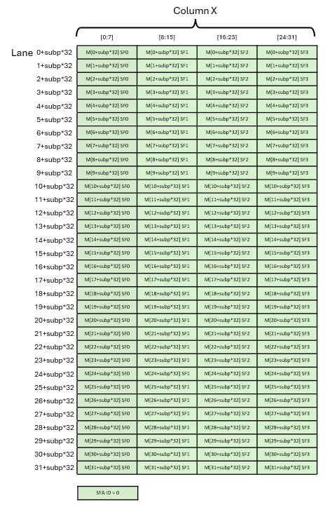

Figure 242 Layout of scale factor A matrix with scale_vec::4X/block16 with K=64/K=128 with 128 lanes

####### 9.7.18.10.7.2.4. Layout of the Scale Factor A Matrix for block32 with K=96 (Semantically equivalent to scale_vec::3X)

There are three scale factors per row of the `A` matrix with block size as 32 and the scale factor must be provided in 4-byte aligned sub-column of the Tensor Memory. _SFA_ID_ specifies the byte offset in the Tensor Memory word that must be used for the scale factor matrix. Figure 243, Figure 244, Figure 245 and Figure 246 show which sub-columns get selected for different values of _SFA_ID_.

Figure 243 Layout of scale factor A matrix with block32 with K=96 with SFA_ID=00

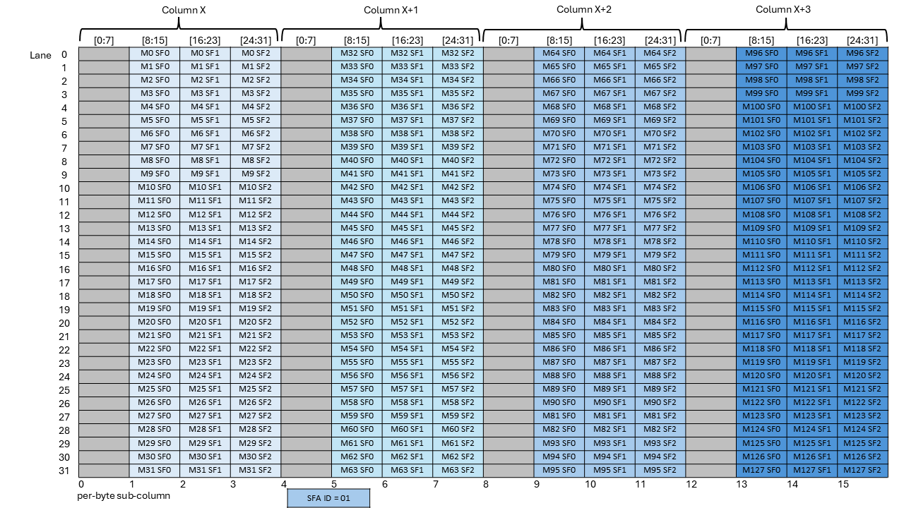

Figure 244 Layout of scale factor A matrix with block32 with K=96 with SFA_ID=01

Figure 245 Layout of scale factor A matrix with block32 with K=96 with SFA_ID=10

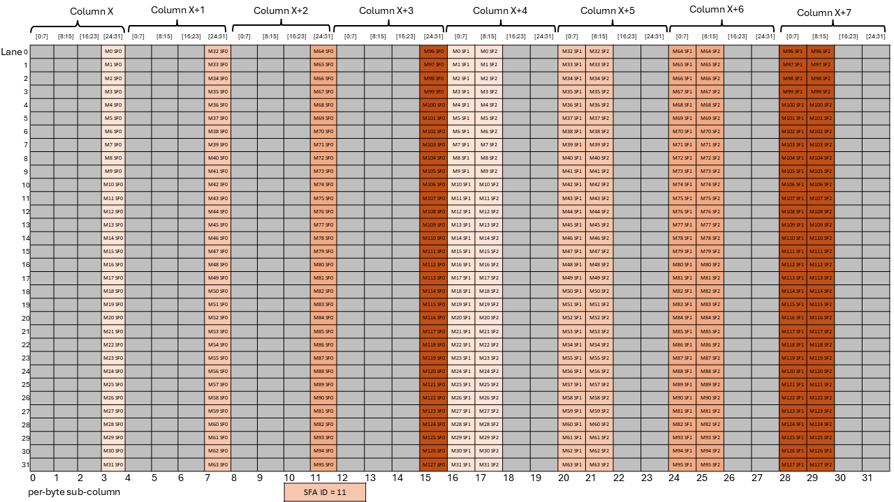

Figure 246 Layout of scale factor A matrix with block32 with K=96 with SFA_ID=11

For example, if _SFA_ID_ is 0, then all the green columns are selected to form the scale factor matrix. Similarly, _SFA_ID_ values of 1, 2 and 3 would select the blue, yellow, and red columns, respectively.

Figure 247, Figure 248, Figure 249 and Figure 250 show the scale factor `A` matrix layout with 128 lanes which is supported on `sm_107f` architecture. Valid values of subp here are [0, 3];

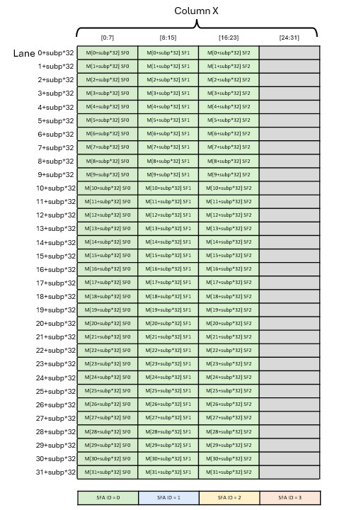

Figure 247 Layout of scale factor A matrix with block32 with K=96 with 128 lanes SFA_ID=00

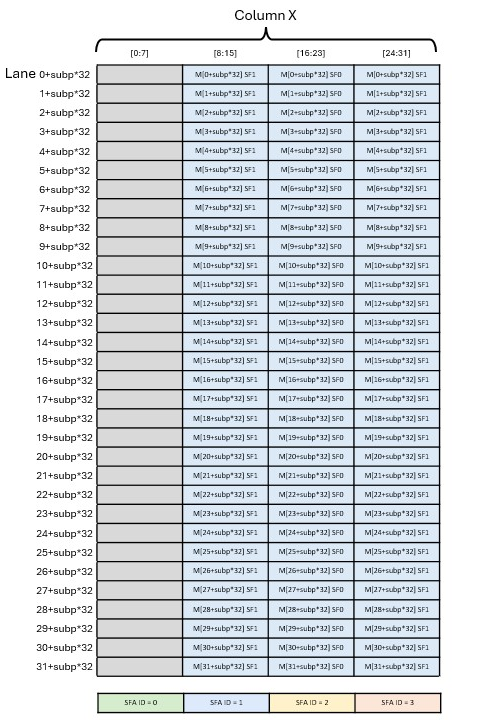

Figure 248 Layout of scale factor A matrix with block32 with K=96 with 128 lanes SFA_ID=01

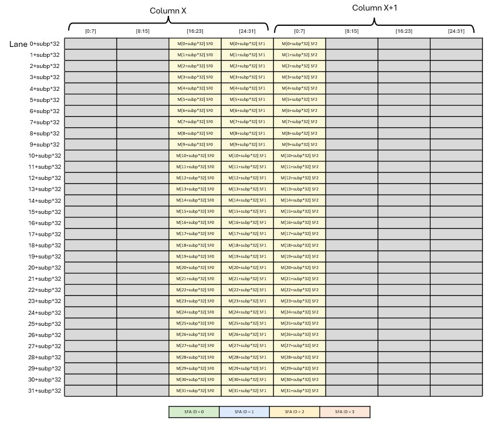

Figure 249 Layout of scale factor A matrix with block32 with K=96 with 128 lanes SFA_ID=10

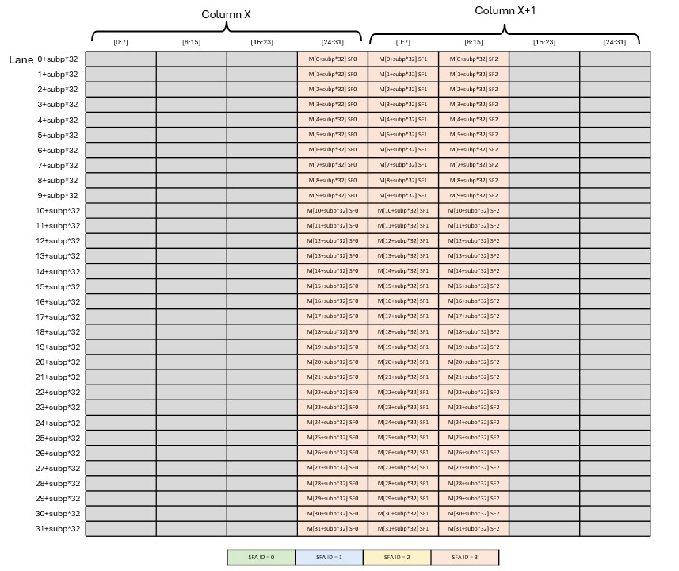

Figure 250 Layout of scale factor A matrix with block32 with K=96 with 128 lanes SFA_ID=11

####### 9.7.18.10.7.2.5. Layout of the Scale Factor A Matrix for block16 with K=96 (Semantically equivalent to scale_vec::6X)

There are six scale factors per row of the `A` matrix with block size as 16 and the scale factor must be provided in 4-byte aligned sub-column of the Tensor Memory. _SFA_ID_ specifies the byte offset in the Tensor Memory word that must be used for the scale factor matrix. Figure 251 and Figure 252 show which sub-columns get selected for different values of _SFA_ID_.

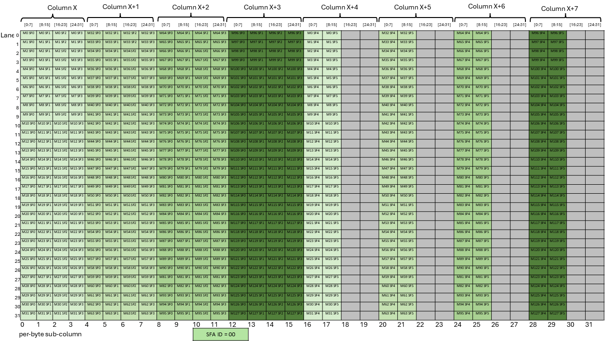

Figure 251 Layout of scale factor A matrix with block16 with K=96 with SFA_ID=00

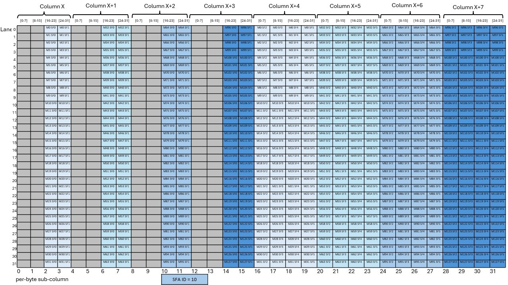

Figure 252 Layout of scale factor A matrix with block16 with K=96 with SFA_ID=10

For example, if _SFA_ID_ is 0, then all the green columns are selected to form the scale factor matrix. Similarly, if _SFA_ID_ is 2, then all of the blue columns are selected to form the scale factor matrix.

Figure 253 and Figure 254 show the scale factor `A` matrix layout with 128 lanes which is supported on `sm_107f` architecture. Valid values of subp here are [0, 3];

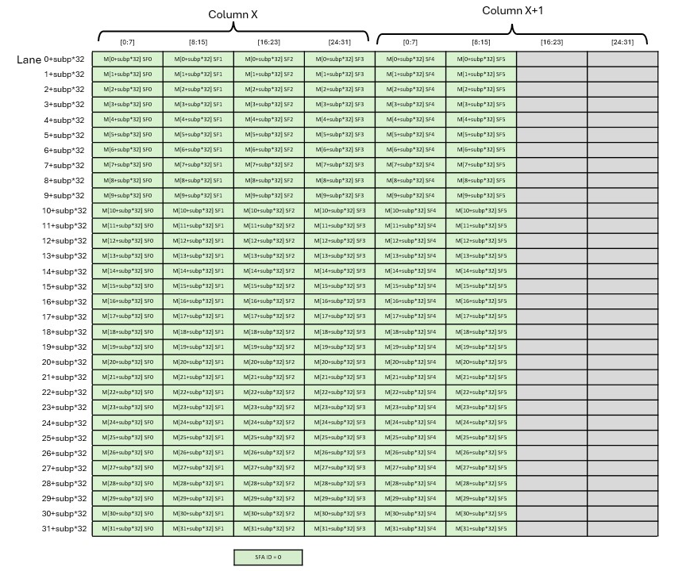

Figure 253 Layout of scale factor A matrix with block16 with K=96 with 128 lanes with SFA_ID=00

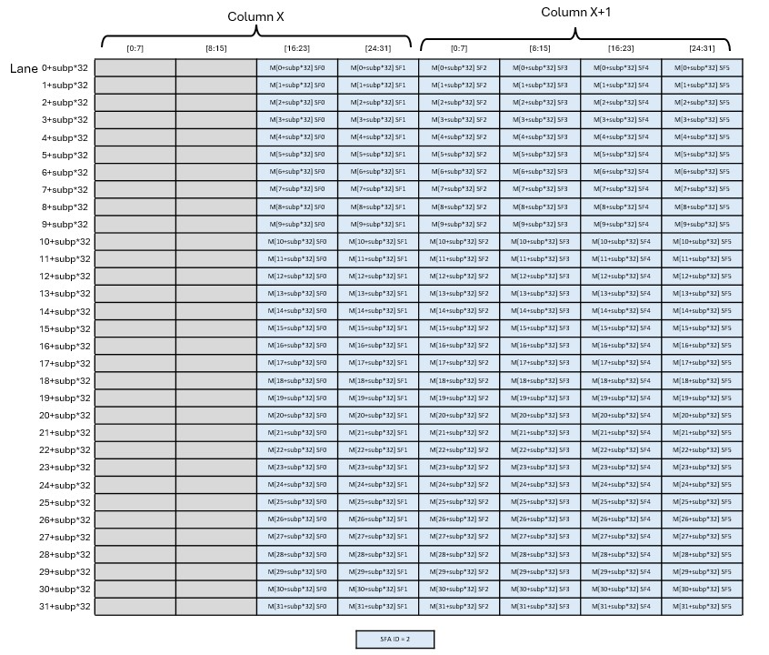

Figure 254 Layout of scale factor A matrix with block16 with K=96 with 128 lanes with SFA_ID=10

####### 9.7.18.10.7.2.6. Layout of the Scale Factor A Matrix for block16 with K=128/256 (Semantically equivalent to scale_vec::8X)

There are eight scale factors per row of the `A` matrix with block size as 16 and the scale factor must be provided in 4-byte aligned sub-column of the Tensor Memory. _SFA_ID_ specifies the byte offset in the Tensor Memory word that must be used for the scale factor matrix and must be 0. Figure 255 shows which sub-columns get selected.

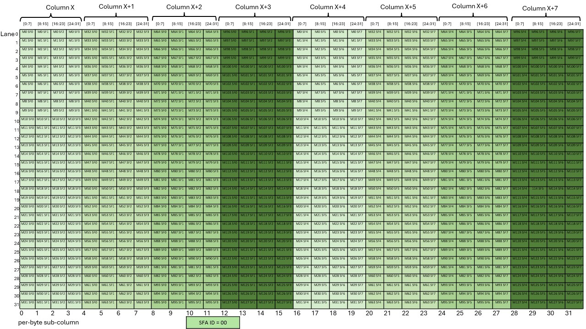

Figure 255 Layout of scale factor A matrix with block16 with K=128/256

Figure 256 shows the scale factor `A` matrix layout with 128 lanes which is supported on `sm_107f` architecture. Valid values of subp here are [0, 3];

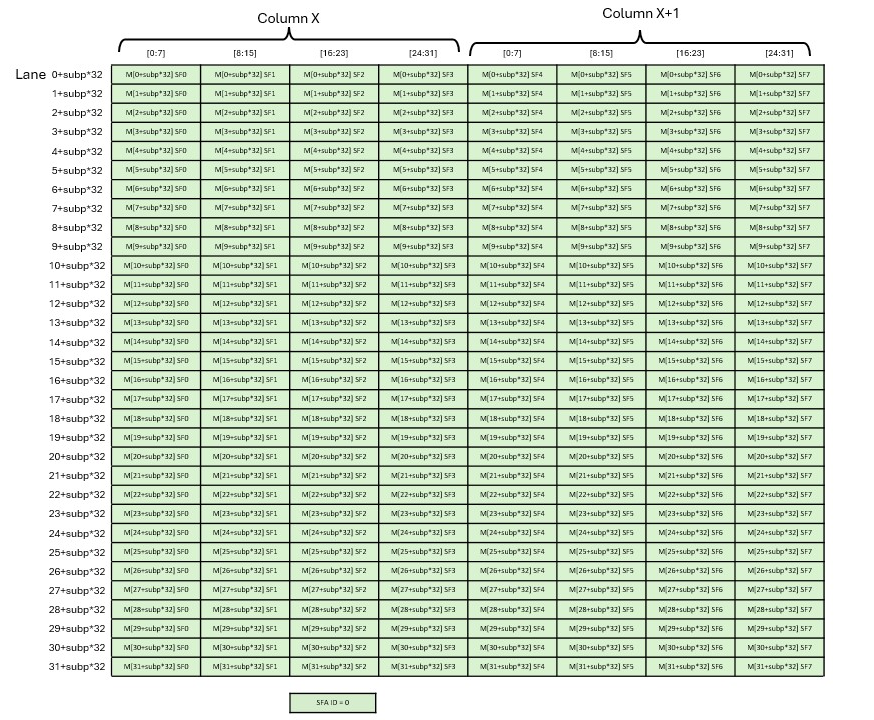

Figure 256 Layout of scale factor A matrix with block16 with K=128/256 with 128 lanes

######  9.7.18.10.7.3. Scale Factor B ID

The value of the scale factor `B ID` selects the sub-columns in the Tensor Memory to form the scale factor `B` matrix, which is used to scale the matrix `B`.

The following shows the scale factor matrix layout for various scale vector sizes:

####### 9.7.18.10.7.3.1. Layout of the Scale Factor B Matrix for scale_vec::1X/block32 with K=32/K=64

There is one scale factor per row of the `B` matrix with block size as 32 and the scale factor must be provided in 1-byte aligned sub-column of the Tensor Memory. _SFB_ID_ specifies the byte offset in the Tensor Memory word that must be used for the scale factor matrix. Figure 257 shows which sub-columns get selected for different values of _SFB_ID_.

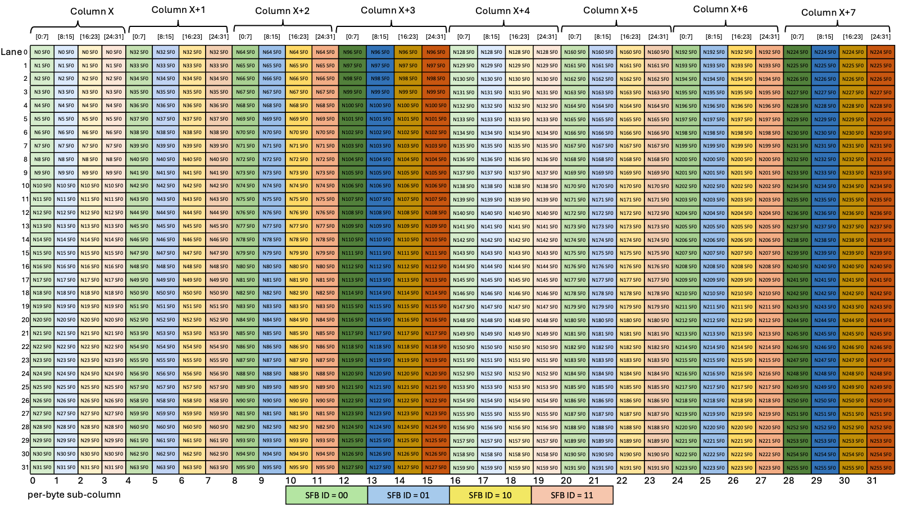

Figure 257 Layout of scale factor B matrix with scale_vec::1X/block32 with K=32/K=64

For example, if _SFB_ID_ is 0, then all the green columns are selected to form the scale factor matrix. Similarly, _SFB_ID_ values of 1, 2 and 3 would select the blue, yellow, and red columns, respectively.

####### 9.7.18.10.7.3.2. Layout of the Scale Factor B Matrix for scale_vec::2X/block32 with K=64/K=128

There are two scale factors per row of the `B` matrix with block size as 32 and the scale factor must be provided in 2-byte aligned sub-column of the Tensor Memory. _SFB_ID_ specifies the half word offset in the Tensor Memory word that must be used for the scale factor matrix. Figure 258 shows which sub-columns get selected for different values of _SFB_ID_.

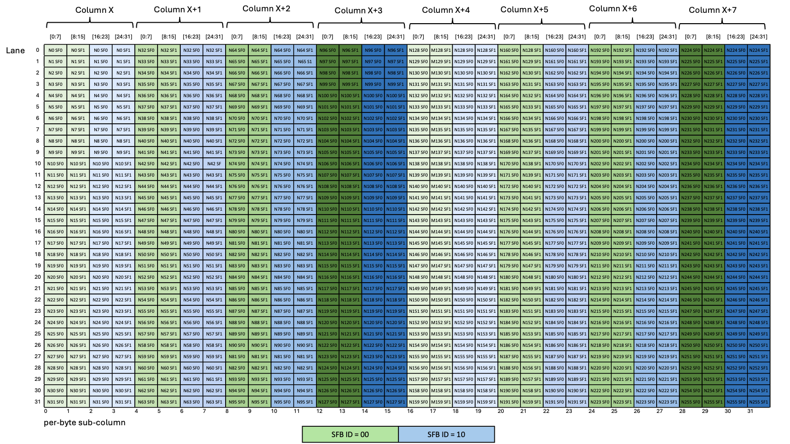

Figure 258 Layout of scale factor B matrix with scale_vec::2X/block32 with K=64/K=128

For example, if _SFB_ID_ is 0, then all the green columns are selected to form the scale factor matrix. Similarly, if _SFB_ID_ is 2, then all of the blue columns are selected to form the scale factor matrix.

####### 9.7.18.10.7.3.3. Layout of the Scale Factor B Matrix for scale_vec::4X/block16 with K=64/K=128

There are four scale factors per row of the `B` matrix with block size as 16 and the scale factor must be provided in 4-byte aligned sub-column of the Tensor Memory. The _SFB_ID_ value must be 0 and this specifies that all of the columns (in green) will be used for the scale factor matrix. Figure 259 shows which sub-columns get selected for different values of _SFB_ID_.

Figure 259 Layout of scale factor B matrix with scale_vec::4X/block16 with K=64/K=128

####### 9.7.18.10.7.3.4. Layout of the Scale Factor B Matrix for block32 with K=96 (Semantically equivalent to scale_vec::3X)

There are three scale factors per row of the `B` matrix with block size as 32 and the scale factor must be provided in 4-byte aligned sub-column of the Tensor Memory. _SFB_ID_ specifies the byte offset in the Tensor Memory word that must be used for the scale factor matrix.

For N<=128, Figure 260, Figure 261, Figure 262 and Figure 263 show which sub-columns get selected for different values of _SFB_ID_.

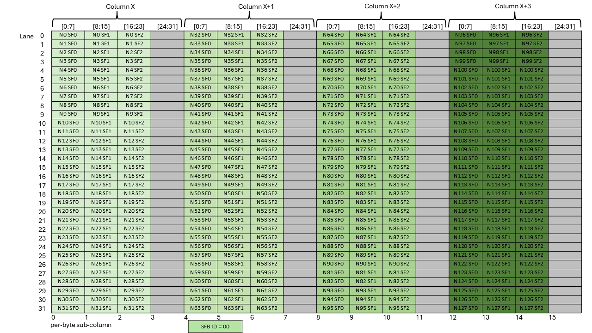

Figure 260 Layout of scale factor B matrix with block32 with K=96 and N<=128 with SFB_ID=00

Figure 261 Layout of scale factor B matrix with block32 with K=96 and N<=128 with SFB_ID=01

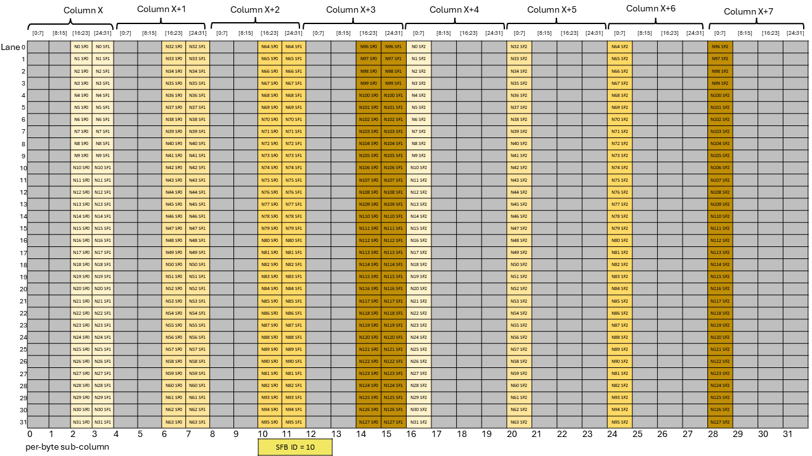

Figure 262 Layout of scale factor B matrix with block32 with K=96 and N<=128 with SFB_ID=10

Figure 263 Layout of scale factor B matrix with block32 with K=96 and N<=128 with SFB_ID=11

For N>128, Figure 264, Figure 265, Figure 266, Figure 267, Figure 268 and Figure 269 show which sub-columns get selected for different values of _SFB_ID_.

Figure 264 Layout of scale factor B matrix with block32 with K=96 and N>128 with SFB_ID=00

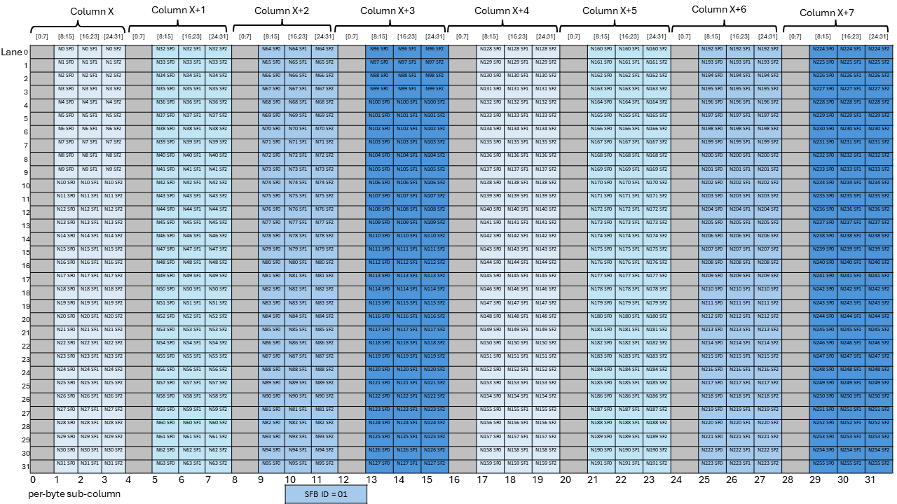

Figure 265 Layout of scale factor B matrix with block32 with K=96 and N>128 with SFB_ID=01

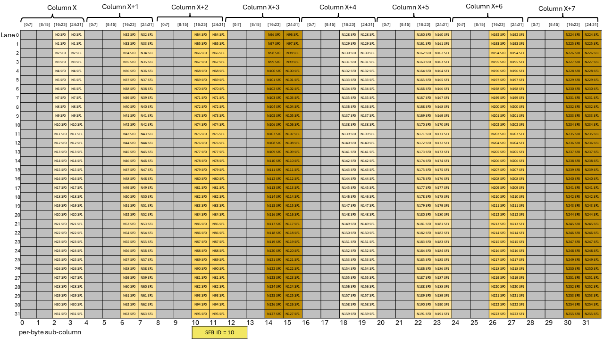

Figure 266 Layout of scale factor B matrix with block32 with K=96 and N>128 with SFB_ID=10

Figure 267 Layout of scale factor B matrix with block32 with K=96 and N>128 with SFB_ID=10

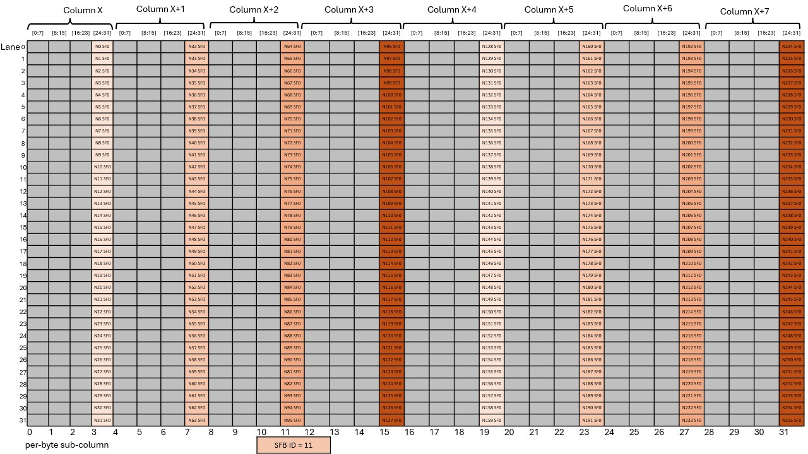

Figure 268 Layout of scale factor B matrix with block32 with K=96 and N>128 with SFB_ID=11

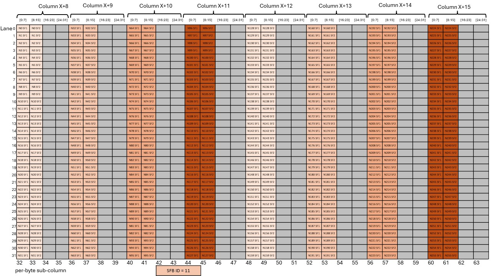

Figure 269 Layout of scale factor B matrix with block32 with K=96 and N>128 with SFB_ID=11

For example, if _SFB_ID_ is 0, then all the green columns are selected to form the scale factor matrix. Similarly, _SFB_ID_ values of 1, 2 and 3 would select the blue, yellow, and red columns, respectively.

####### 9.7.18.10.7.3.5. Layout of the Scale Factor B Matrix for block16 with K=96 (Semantically equivalent to scale_vec::6X)

There are six scale factors per row of the `B` matrix with block size as 16 and the scale factor must be provided in 4-byte aligned sub-column of the Tensor Memory. _SFB_ID_ specifies the byte offset in the Tensor Memory word that must be used for the scale factor matrix.

For N<=128, Figure 270 and Figure 271 show which sub-columns get selected for different values of _SFB_ID_.

Figure 270 Layout of scale factor B matrix with block16 with K=96 and N<=128 with SFB_ID=00

Figure 271 Layout of scale factor B matrix with block16 with K=96 and N<=128 with SFB_ID=10

For N>128, Figure 272, Figure 273, Figure 274 and Figure 275 show which sub-columns get selected for different values of _SFB_ID_.

Figure 272 Layout of scale factor B matrix with block16 with K=96 and N>128 with SFB_ID=00

Figure 273 Layout of scale factor B matrix with block16 with K=96 and N>128 with SFB_ID=00

Figure 274 Layout of scale factor B matrix with block16 with K=96 and N>128 with SFB_ID=10

Figure 275 Layout of scale factor B matrix with block16 with K=96 and N>128 with SFB_ID=10

For example, if _SFB_ID_ is 0, then all the green columns are selected to form the scale factor matrix. Similarly, if _SFB_ID_ is 2, then all of the blue columns are selected to form the scale factor matrix.

####### 9.7.18.10.7.3.6. Layout of the Scale Factor B Matrix for block16 with K=128/256 (Semantically equivalent to scale_vec::8X)

There are eight scale factors per row of the `B` matrix with block size as 16 and the scale factor must be provided in 4-byte aligned sub-column of the Tensor Memory. _SFB_ID_ specifies the byte offset in the Tensor Memory word that must be used for the scale factor matrix.

For N<=128, Figure 276 shows which sub-columns get selected for different values of _SFB_ID_.

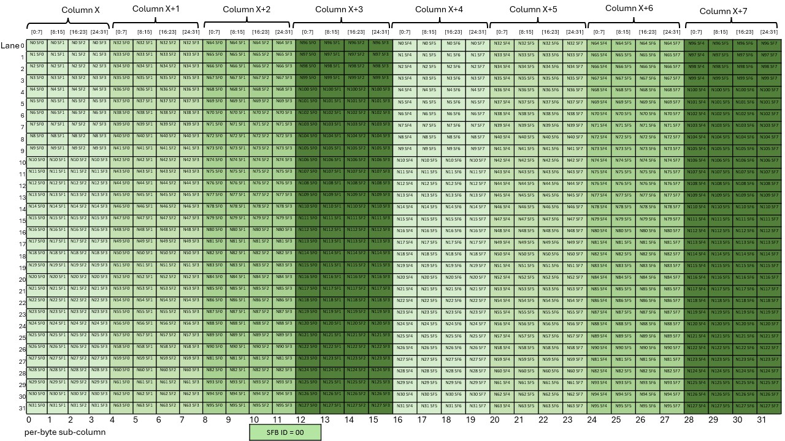

Figure 276 Layout of scale factor B matrix with block16 with K=128/256 and N<=128 with SFB_ID=00

For N>128, Figure 277 and Figure 278 show which sub-columns get selected for different values of _SFB_ID_.

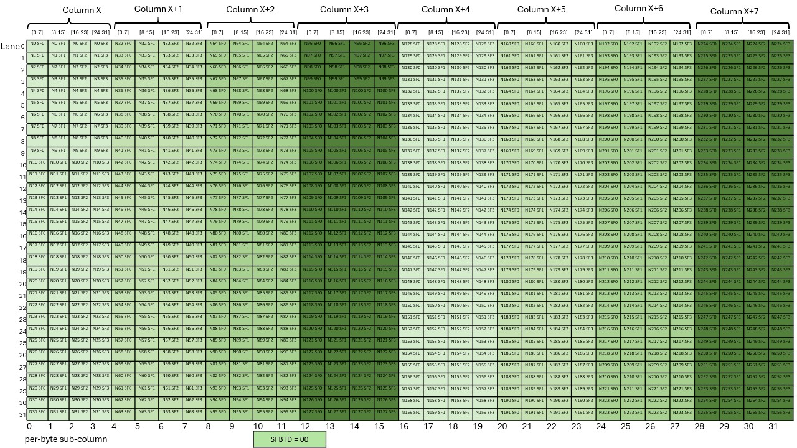

Figure 277 Layout of scale factor B matrix with block16 with K=128/256 and N>128 with SFB_ID=00

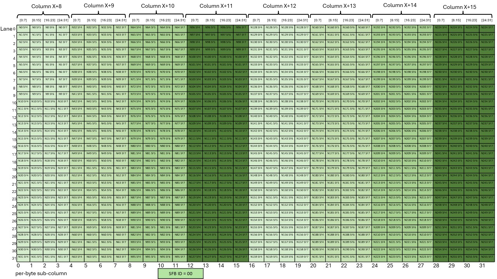

Figure 278 Layout of scale factor B matrix with block16 with K=128/256 and N>128 with SFB_ID=00

#####  9.7.18.10.8. Decompression of input matrices

The `tcgen05.mma` instructions with the following `.kind` qualifier:

  * `.kind::f8f6f4`

  * `.kind::mxf8f6f4`

supports decompression of pre-compressed input matrix `B`.

The values of the matrix `B` reside in a lookup table in the Tensor Memory and the input operand in the instruction points to a compressed matrix which contains the indices into the lookup table.

Figure 279 shows the layout of Lookup table stored in Tensor Memory.

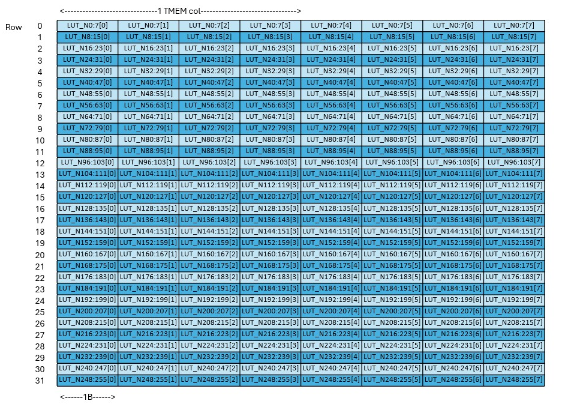

Figure 279 Layout of Lookup table in Tensor Memory

`B` matrix of shape _NxK_ is compressed as shown in Figure 280.

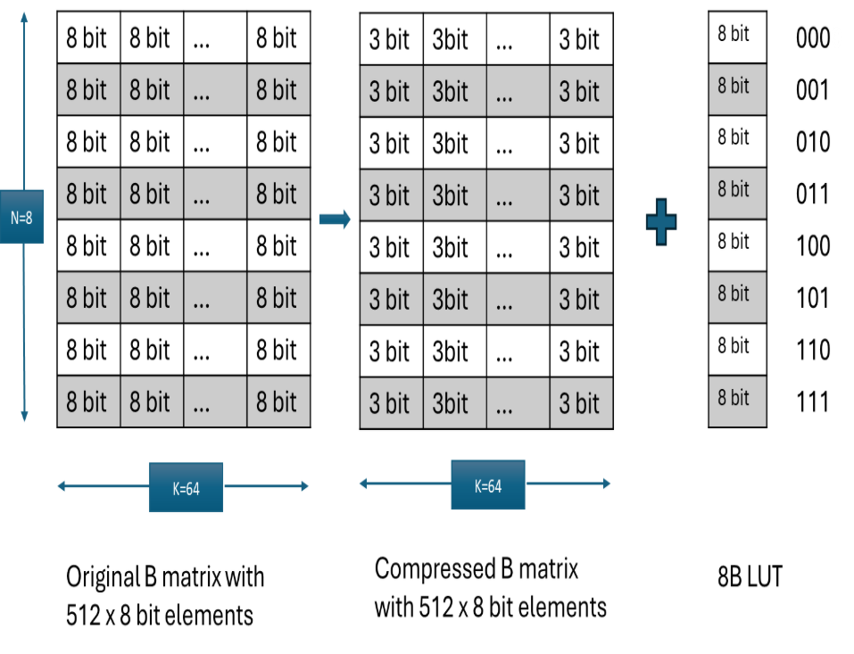

Figure 280 B matrix of NxK compressed for 8B LUT

Figure 281 shows how the compressed Matrix B is used in the matrix computation.

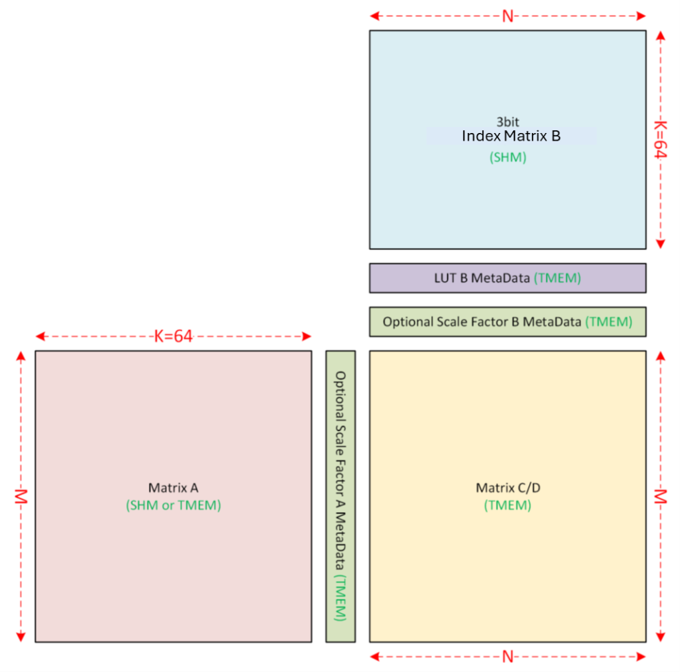

Figure 281 Matrix B usage in computation

Figure 282 shows the GMEM and TMEM layouts of the lookup table. The GMEM layout shows 4 blocks of 128B such that each block contains 8 rows and 2 columns.

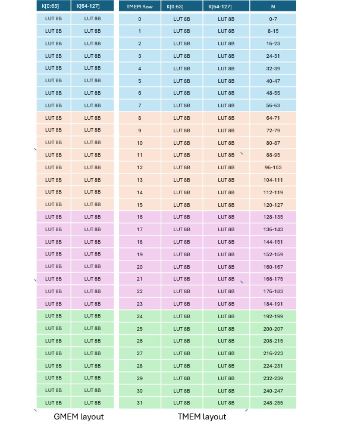

Figure 282 GMEM and TMEM layout of look-up-table

#####  9.7.18.10.9. Sparse Matrices

This instruction `tcgen05.mma.sp` can be used when the matrix `A` is a structured sparse matrix with 50% zeros in each row distributed as per its sparse granularity.

In a _MxNxK_ sparse `tcgen05.mma.sp` operation, the matrix `A` of shape _MxK_ is stored in a packed form as _Mx(K/2)_ in memory. For each _K-wide_ row of matrix `A`, 50% of elements are zeros and the remaining _K/2_ non-zero elements are stored in memory. The metadata specifies the mapping of the _K/2_ non-zero elements to the _K_ elements before performing the MMA operation.

Granularity of sparse matrix `A` is defined as the ratio of the number of non-zero elements in a sub-chunk of the matrix row to the total number of elements in that sub-chunk where the size of the sub-chunk is shape-specific. The following table lists the granularity of different `tcgen05.mma.sp` variants:

.kind of tcgen05.mma | Sparse Granularity | Sparsity Version  
---|---|---  
`.kind::tf32` | 1:2 | N/A  
`.kind::f16` | 2:4  
`.kind::ti16`  
`.kind::f8f6f4`  
`.kind::mxf8f6f4`  
`.kind::i8`  
`.kind::mxf4` | 4:8 (in pairs) | `v0`  
2:4 | `v1`  
`.kind::mxf4nvf4` | 4:8 (in pairs) | `v0`  
2:4 | `v1`  
  
######  9.7.18.10.9.1. Sparse `tcgen05.mma.sp` with `.kind::tf32`

For `.kind::tf32`, matrix `A` is structured sparse at a granularity of `1:2`. In other words, each chunk of two adjacent elements in a row of matrix `A` has one zero and one non-zero element. Only the non-zero element is stored in memory and the 4-bit index in the metadata indicates the position of the non-zero element in the two-wide chunk. The only meaningful values of the index are:

  * `0b1110`

  * `0b0100`

Rest of the values result in undefined behavior.

Figure 283 Sparse tcgen05.mma metadata example for tf32 kind

######  9.7.18.10.9.2. Sparse `tcgen05.mma.sp` with `.kind::f16`, `.kind::f8f6f4`, `.kind::mxf8f6f4`, `.kind::i8`, `.kind::ti16`

For the following `.kind` variants of `tcgen05.mma`:

  * `.kind::f16`

  * `.kind::f8f6f4`

  * `.kind::mxf8f6f4`

  * `.kind::i8`

  * `.kind::ti16`

matrix `A` is structured sparse at a granularity of `2:4`. In other words, each chunk of four adjacent elements in a row of matrix `A` has two zero and two non-zero elements. Only the non-zero elements are stored in memory and the two 2-bit indices in the metadata indicates the position of the two non-zero elements in the four-wide chunk. The only meaningful values of the index are:

  * `0b0100`

  * `0b1000`

  * `0b1100`

  * `0b1001`

  * `0b1101`

  * `0b0110`

  * `0b1110`

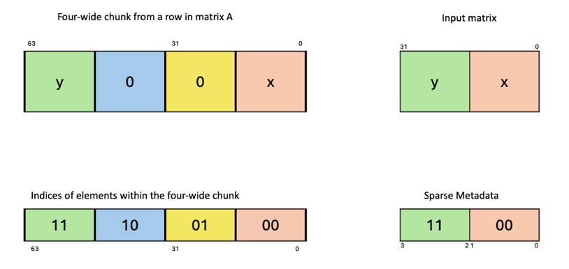

Figure 284 Sparse tcgen05.mma metadata example for f16/f8f6f4/mxf8f6f4 kind

######  9.7.18.10.9.3. Sparse `tcgen05.mma.sp` with `.kind::mxf4` and `.kind::mxf4nvf4`

The sparsity granularity for `.kind::mxf4` and `.kind::mxf4nvf4` is determined by the SparsityVersion field (bit 12) of the Instruction descriptor:

  * **SparsityVersion** `v0` (bit 12 = 0): Applicable to `sm_100a`, `sm_103a`, and `sm_110a`. Matrix `A` is pair-wise structured sparse at a granularity of `4:8`. Each chunk of eight adjacent elements in a row has four zeros and four non-zero elements, clustered in two-element sub-chunks. Only the four non-zero elements are stored in memory and the two 2-bit indices in the metadata indicate the positions of the two non-zero two-wide sub-chunks within the eight-wide chunk.

  * **SparsityVersion** `v1` (bit 12 = 1): Applicable to `sm_107a`. Matrix `A` is structured sparse at a granularity of `2:4`. Each chunk of four adjacent elements in a row has two zeros and two non-zero elements. Only the two non-zero elements are stored in memory and the two 2-bit indices in the metadata indicate the positions of the two non-zero elements within the four-wide chunk. The metadata format and valid index values are the same as for `.kind::mxf8f6f4` (see Sparse tcgen05.mma.sp with .kind::f16, .kind::f8f6f4, .kind::mxf8f6f4, .kind::i8, .kind::ti16).

The only meaningful values of the metadata index are:

  * `0b0100`

  * `0b1000`

  * `0b1100`

  * `0b1001`

  * `0b1101`

  * `0b0110`

  * `0b1110`

Rest of the values result in undefined behavior.

Note

Bit 12 of the instruction descriptor (SparsityVersion) must be set to `v0` for `sm_100a`, `sm_103a`, `sm_110a` and to `v1` for `sm_107a`. Using the wrong SparsityVersion results in undefined behavior. See Instruction descriptor for details.

Figure 285 Sparse tcgen05.mma metadata example for mxf4 kind (SparsityVersion `v0`, 4:8)

Figure 286 Sparse tcgen05.mma metadata example for mxf4 kind (SparsityVersion `v1`, 2:4)

######  9.7.18.10.9.4. Sparsity selector

The value of the sparsity selector selects the sub-columns in the Tensor Memory to form the sparsity metadata matrix, which is used with matrix `A` to form the multiplicand matrix.

The following shows the sparse metadata matrix layout in Tensor Memory for various MMA variants:

####### 9.7.18.10.9.4.1. Layout of the Sparsity Metadata Matrix for M = 64 for `.kind::f16`, `.kind::ti16`

Figure 287 shows which sub-columns get selected for different values of Sparsity Selector.

Figure 287 Sparsity Metadata Layout for M = 64 for `.kind::f16`

####### 9.7.18.10.9.4.2. Layout of the Sparsity Metadata Matrix for M = 128 / M = 256 for `.kind::f16`, `.kind::ti16`

Figure 288 shows which sub-columns get selected for different values of Sparsity Selector.

Figure 288 Sparsity Metadata Layout for M = 128 / M = 256 for `.kind::f16`

####### 9.7.18.10.9.4.3. Layout of the Sparsity Metadata Matrix for M = 64 for `.kind::tf32`

Figure 289 shows which sub-columns get selected for different values of Sparsity Selector.

Figure 289 Sparsity Metadata Layout for M = 64 for `.kind::tf32`

####### 9.7.18.10.9.4.4. Layout of the Sparsity Metadata Matrix for M = 128 / M = 256 for `.kind::tf32`

Figure 290 shows which sub-columns get selected for different values of Sparsity Selector.

Figure 290 Sparsity Metadata Layout for M = 128 / M = 256 for `.kind::tf32`

####### 9.7.18.10.9.4.5. Layout of the Sparsity Metadata Matrix for M = 64 for `.kind::f8f6f4`, `.kind::mxf8f6f4`, `.kind::i8`, `.kind::mxf4`, `.kind::mxf4nvf4`

The value of the sparsity selector:

  * must be 0 for `.kind::i8` and `.kind::f8f6f4`

  * is assumed to be 0 for `.kind::mxf8f6f4`, `.kind::mxf4` and `.kind::mxf4nvf4`

and all of the columns are selected as shown in Figure 291

Figure 291 Sparsity Metadata Layout for M = 64 for `.kind::f8f6f4`, `.kind::mxf8f6f4`, `.kind::i8`, `.kind::mxf4`, `.kind::mxf4nvf4`

####### 9.7.18.10.9.4.6. Layout of the Sparsity Metadata Matrix for M = 128 / M = 256 for `.kind::f8f6f4`, `.kind::mxf8f6f4`, `.kind::i8`, `.kind::mxf4`, `.kind::mxf4nvf4`

The value of the sparsity selector:

  * must be 0 for `.kind::i8` and `.kind::f8f6f4`

  * is assumed to be 0 for `.kind::mxf8f6f4`, `.kind::mxf4` and `.kind::mxf4nvf4`

and all of the columns are selected as shown in Figure 292

Figure 292 Sparsity Metadata Layout for M = 128 / M = 256 for `.kind::f8f6f4`, `.kind::mxf8f6f4`, `.kind::i8`, `.kind::mxf4`, `.kind::mxf4nvf4`

######  9.7.18.10.9.5. Alignment restriction

The layouts which utilize only half the datapath lanes as specified in Data Path Layout Organization, i.e. Layout F and Layout C, must use the same alignment across matrices A, D and the sparsity metadata matrix.

#####  9.7.18.10.10. TensorCore 5th Generation of MMA Instructions

######  9.7.18.10.10.1. TensorCore 5th Generation Instructions: `tcgen05.mma`

`tcgen05.mma`

Perform the 5th generation of matrix multiply and accumulate operation.

Syntax
    
    
    // 1. Floating-point type without block scaling:
    
    tcgen05.mma.cta_group.kind   [d-tmem],  a-desc,  b-desc, idesc,
                                 { disable-output-lane }, enable-input-d {, scale-input-d};
    
    tcgen05.mma.cta_group.kind   [d-tmem], [a-tmem], b-desc, idesc,
                                 { disable-output-lane }, enable-input-d {, scale-input-d};
    
    .kind      = { .kind::f16, .kind::tf32, .kind::f8f6f4 }
    .cta_group = { .cta_group::1, .cta_group::2 }
    
    ----------------------------------------------------------------------------------
    
    // 2. Floating-point type with block scaling:
    
    tcgen05.mma.cta_group.kind.block_scale{.scale_vectorsize}
                                            [d-tmem],  a-desc,  b-desc, idesc,
                                            [scale-A-tmem], [scale-B-tmem], enable-input-d;
    
    tcgen05.mma.cta_group.kind.block_scale{.scale_vectorsize}
                                            [d-tmem], [a-tmem], b-desc, idesc,
                                            [scale-A-tmem], [scale-B-tmem], enable-input-d;
    
    .kind = { .kind::mxf8f6f4, .kind::mxf4, .kind::mxf4nvf4 }
    .cta_group      = { .cta_group::1,   .cta_group::2 }
    .scale_vectorsize = { .scale_vec::1X, .scale_vec::2X, .scale_vec::4X, .block16, .block32 }
    
    ----------------------------------------------------------------------------------
    
    // 3. Convolution MMA for floating-point type without block scaling:
    
    tcgen05.mma.cta_group.kind.collector_a_usage{.collector_b_usage}
                                               [d-tmem],  a-desc,  b-desc, idesc,
                                               { disable-output-lane }, enable-input-d {, scale-input-d};
    
    tcgen05.mma.cta_group.kind{.ashift}.collector_a_usage{.collector_b_usage}
                                               [d-tmem], [a-tmem], b-desc, idesc,
                                               { disable-output-lane }, enable-input-d {, scale-input-d};
    
    tcgen05.mma.cta_group.kind.ashift{.collector_a_usage}{.collector_b_usage}
                                               [d-tmem], [a-tmem], b-desc, idesc,
                                               { disable-output-lane }, enable-input-d {, scale-input-d};
    
    .kind      = { .kind::f16, .kind::tf32, .kind::f8f6f4 }
    .cta_group = { .cta_group::1,   .cta_group::2 }
    .collector_a_usage = { .collector::buffer_a::op }
    .collector_b_usage = { .collector::buffer_b::op }
    ::buffer_a         = { ::a }
    ::buffer_b         = { ::b }
    ::op             = { ::fill, ::use, ::lastuse, ::discard* }
    
    ----------------------------------------------------------------------------------
    
    // 4. Activation Stationary MMA for floating-point type with block scaling:
    
    tcgen05.mma.cta_group.kind.block_scale{.scale_vectorsize}.collector_a_usage{.collector_b_usage}
                                                [d-tmem],  a-desc,  b-desc, idesc,
                                                [scale-A-tmem], [scale-B-tmem], enable-input-d;
    
    tcgen05.mma.cta_group.kind.block_scale{.scale_vectorsize}.collector_a_usage{.collector_b_usage}
                                                [d-tmem], [a-tmem], b-desc, idesc,
                                                [scale-A-tmem], [scale-B-tmem], enable-input-d;
    
    .cta_group       = { .cta_group::1,   .cta_group::2 }
    .scale_vectorsize  = { .scale_vec::1X, .scale_vec::2X, .scale_vec::4X, .block16, .block32 }
    .kind            = { .kind::mxf8f6f4, .kind::mxf4, .kind::mxf4nvf4 }
    .collector_a_usage = { .collector::buffer_a::op }
    .collector_b_usage = { .collector::buffer_b::op }
    ::buffer_a         = { ::a }
    ::buffer_b         = { ::b }
    ::op             = { ::fill, ::use, ::lastuse, ::discard* }
    
    ----------------------------------------------------------------------------------
    
    // 5. Integer type:
    
    tcgen05.mma.cta_group.kind  [d-tmem],  a-desc,  b-desc, idesc,
                                  { disable-output-lane }, enable-input-d;
    
    tcgen05.mma.cta_group.kind  [d-tmem], [a-tmem], b-desc, idesc,
                                  { disable-output-lane }, enable-input-d;
    
    tcgen05.mma.cta_group.kind::ti16.collector_b_usage
                                [d-tmem], a-desc, b-desc, idesc,
                                { disable-output-lane }, enable-input-d;
    
    tcgen05.mma.cta_group.kind::ti16.collector_b_usage
                                [d-tmem], [a-tmem], b-desc, idesc,
                                { disable-output-lane }, enable-input-d;
    
    .cta_group = { .cta_group::1,   .cta_group::2  }
    .kind = { .kind::i8, .kind::ti16 }
    .collector_b_usage = { .collector::buffer::op }
    ::buffer         = { ::b }
    ::op             = { ::fill, ::use, ::lastuse, ::discard* }
    
    ----------------------------------------------------------------------------------
    
    // 6. Convolution MMA for integer type:
    
    tcgen05.mma.cta_group.kind.collector_a_usage          [d-tmem],  a-desc,  b-desc, idesc,
                                                            { disable-output-lane }, enable-input-d;
    
    tcgen05.mma.cta_group.kind.ashift{.collector_a_usage} [d-tmem], [a-tmem], b-desc, idesc,
                                                            { disable-output-lane }, enable-input-d;
    
    tcgen05.mma.cta_group.kind{.ashift}.collector_a_usage [d-tmem], [a-tmem], b-desc, idesc,
                                                            { disable-output-lane }, enable-input-d;
    
    tcgen05.mma.cta_group.kind::ti16.collector_a_usage.collector_b_usage
                                                          [d-tmem],  a-desc,  b-desc, idesc,
                                                          { disable-output-lane }, enable-input-d;
    
    tcgen05.mma.cta_group.kind::ti16.ashift{.collector_a_usage}.collector_b_usage
                                                          [d-tmem], [a-tmem], b-desc, idesc,
                                                          { disable-output-lane }, enable-input-d;
    
    tcgen05.mma.cta_group.kind::ti16{.ashift}.collector_a_usage.collector_b_usage
                                                          [d-tmem], [a-tmem], b-desc, idesc,
                                                          { disable-output-lane }, enable-input-d;
    
    .cta_group         = { .cta_group::1,   .cta_group::2 }
    .kind              = { .kind::i8, .kind::ti16 }
    .collector_a_usage = { .collector::buffer_a::op }
    .collector_b_usage = { .collector::buffer_b::op }
    ::buffer_a         = { ::a }
    ::buffer_b         = { ::b }
    ::op               = { ::fill, ::use, ::lastuse, ::discard* }
    
    ----------------------------------------------------------------------------------
    
    // 7. Decompression of pre-compressed B matrix
    
    tcgen05.mma.cta_group.kind::f8f6f4.decompress::lut::b{.collector_a_usage}{.collector_b_usage}
                                                   [d-tmem],  a-desc,  b-compressed-desc,
                                                   [b-decompress-metadata], idesc,
                                                   { disable-output-lane }, enable-input-d;
    
    tcgen05.mma.cta_group.kind::f8f6f4.decompress::lut::b{.collector_a_usage}{.collector_b_usage}
                                                   [d-tmem], [a-tmem], b-compressed-desc,
                                                   [b-decompress-metadata],  idesc,
                                                   { disable-output-lane }, enable-input-d;
    
    tcgen05.mma.cta_group.kind::mxf8f6f4.block_scale.decompress::lut::b{.scale_vectorsize}{.collector_a_usage}{.collector_b_usage}
                                                   [d-tmem],  a-desc,  b-compressed-desc,
                                                   [b-decompress-metadata], idesc,
                                                   [scale-A-tmem], [scale-B-tmem],
                                                   enable-input-d;
    
    tcgen05.mma.cta_group.kind::mxf8f6f4.block_scale.decompress::lut::b{.scale_vectorsize}{.collector_a_usage}{.collector_b_usage}
                                                   [d-tmem], [a-tmem], b-compressed-desc,
                                                   [b-decompress-metadata],  idesc,
                                                   [scale-A-tmem], [scale-B-tmem],
                                                   enable-input-d;
    
    .cta_group        = { .cta_group::1,   .cta_group::2 }
    .scale_vectorsize = { .block32 }
    .collector_a_usage = { .collector::buffer_a::op }
    .collector_b_usage = { .collector::buffer_b::op }
    ::buffer_a         = { ::a }
    ::buffer_b         = { ::b }
    ::op             = { ::fill, ::use, ::lastuse, ::discard* }
    

Description

Instruction `tcgen05.mma` is an asynchronous instruction which initiates an _MxNxK_ matrix multiply and accumulate operation, `D = A*B+D` where the `A` matrix is _MxK_ , the `B` matrix is _KxN_ , and the `D` matrix is _MxN_.

The operation of the form `D = A*B` is issued when the input predicate argument `enable-input-d` is false.

The optional immediate argument `scale-input-d` can be specified to scale the input matrix `D` as follows: `D = A*B+D * (2 ^ - scale-input-d)`

The valid range of values for argument `scale-input-d` is [0, 15]. The argument `scale-input-d` is only valid for `.kind::tf32` and `.kind::f16`.

The 32-bit register operand `idesc` is the instruction descriptor as described in Instruction descriptor, specifies the shapes, exact types, sparsity and other details of the input matrices, output matrix and the matrix multiply and accumulate operation.

The qualifier `.cta_group::1` specifies that the matrix multiply and accumulate operation is performed on the Tensor Memory of the executing thread’s CTA only. The qualifier `.cta_group::2` specifies that the matrix multiply and accumulate operation is performed on the Tensor Memory of the executing thread’s CTA and its peer CTA.

All `tcgen05` instructions within a kernel must specify the same value for the `.cta_group` qualifier.

The instruction `tcgen05.mma` has single thread semantics, unlike the collective instructions `mma.sync` or `wgmma.mma_async`. So, a single thread issuing the `tcgen05.mma` will result in the initiation of the whole matrix multiply and accumulate operation. Refer to the section Issue Granularity.

The qualifier `.kind` specifies the general kind of the element types of the multiplicand matrices. The exact types of the elements of the input and output matrices for each MMA-kind are specified in the Instruction descriptor.

The address operand `d-tmem` specifies the address of the destination and the accumulation matrix `D` in the Tensor Memory. The address operand `a-tmem` specifies the address of the matrix `A` in the Tensor Memory. The 64-bit register operand `a-desc` and `b-desc` are the matrix descriptors which represent the matrices `A` and `B` in shared memory respectively. The format of the matrix descriptor is described in Matrix Descriptors.

For instruction with `.decompress::lut::b` qualifier, `B` matrix elements are obtained from look-up-table. The 64 bit register operand `b-compressed-desc` is the shared memory descriptor for `B` matrix and `b-decompress-metadata` is the two column aligned address of the lookup table stored in Tensor Memory. Data loaded from shared memory contains a 3-bit index for each element, which is used to index the lookup table to get the 8 bit value. Every element in the same 8-column-aligned 8-column slice of the `B` matrix shares the same set of 8 possible values to choose from. For example, the lookup table contains 8 unique values for the elements with N coordinates 0-7, another 8 unique values for the elements with N coordinate 8-15 and so on. When `.decompress::lut::b` is specified, matrix `B` doesn’t support transpose and the only type allowed is `E4M3`. Layout B (M = 128 + cta_group::2 + Dense A matrix), Layout C (M = 128 + cta_group::2 + Sparse A matrix) and Layout F (M = 64 + non .ws mode) are not allowed for storing the lookup tables in Tensor Memory.

The vector operand `disable-output-lane` specifies the lane(s) in the Tensor Memory that should be not be updated with the resultant matrix `D`. Elements of the vector operand `disable-output-lane` forms a mask where each bit corresponds to a lane of the Tensor Memory, with least significant bit of the first element of the vector (leftmost in syntax) corresponding to the lane 0 of the Tensor Memory. If a bit in the mask is 1, then the corresponding lane in the Tensor Memory for the resultant matrix `D` will not be updated. The size of the vector is as follows:

.cta_group | Size of the vector disable-output-lane  
---|---  
::1 | 4  
::2 | 8  
  
Qualifier `.block_scale` specifies that the matrices `A` and `B` are scaled with `scale_A` and `scale_B` matrices respectively before performing the matrix multiply and accumulate operation as specified in the section Block Scaling for tcgen05.mma. The address operand `scale-A-tmem` and `scale-B-tmem` specify the base address the matrices `scale_A` and `scale_B` respectively in the Tensor Memory.

For qualifier `.scale_vectorsize`,

  * If `.scale_vec::NX` is specified: N specifies the number of columns in `scale_A` matrix and number of rows in `scale_B` matrix.

  * If `.blockN` is specified: N specifies the block size for which single scale factor will be applied. In this form, value of N is same as the K-dimension / (N of `.scale_vec::NX`).

Aliased `.scale_vectorsize` variants:

  1. `.block16` is aliased with:

     1. `.scale_vec::4X` when `.kind = .kind::mxf4nvf4` and K = 64 or 128

  2. `.block32` is aliased with:

     1. `.scale_vec::1X` when `.kind = .kind::mxf8f6f4` for all supported values of K

     2. `.scale_vec::2X` when `.kind = .kind::mxf4` or `.kind::mxf4nvf4` and K = 64 or 128

The valid combinations of MMA-kind and `.scale_vectorsize` are described in Table 68. For `.kind::mxf4` when the qualifier `.scale_vectorsize` is not specified, then it defaults to `.block32`. For `.kind::mxf4nvf4`, the qualifier `.scale_vectorsize` must be explicitly specified.

The qualifier `.ashift` shifts the rows of the `A` matrix down by one row, except for the last row in the Tensor Memory. Qualifier `.ashift` is only allowed with _M_ = 128 or _M_ = 256.

The qualifier `.collector_a_usage` specifies the usage of collector buffer for matrix `A`. The qualifier `.collector_b_usage` specifies the usage of collector buffer for matrix `B`. Following collector buffer operations can be specified:

.collector_usage | Semantics  
---|---  
`.collector::a::fill`, `.collector::b::fill` | Specified matrix read from the memory should be filled in collector buffer.  
`.collector::a::use`, `.collector::b::use` | Specified matrix can be read from the collector buffer. This requires a previous fill to the collector buffer to be still valid.  
`.collector::a::lastuse`, `.collector::b::lastuse` | Specified matrix can be read from the collector buffer and the contents of the collector buffer can be discarded. This requires a previous fill to the collector buffer to be valid till the collector buffer is read.  
`.collector::a::discard`, `.collector::b::discard` | Contents of the collector buffer for the specified matrix can be discarded.  
  
If no `.collector_a_usage` qualifier is specified, then it defaults to `.collector::a::discard`. If no `.collector_b_usage` qualifier is specified, then it defaults to `.collector::b::discard`. It is illegal to specify either of `.collector::a::use` or `.collector::a::fill` along with `.ashift`.

For `.kind::mxf8f6f4` and `.kind::f8f6f4` with dense K=64 and sparse K=128, matrix `A` in shared memory can be transposed only for formats `E5M2` and `E4M3`.

PTX ISA Notes

Introduced in PTX ISA version 8.6.

Qualifier `.kind::mxf4nvf4` introduced in PTX ISA version 8.7.

Qualifiers `.block16` and `.block32` introduced in PTX ISA version 8.8.

Qualifier `.kind::ti16` introduced in PTX ISA version 9.4.

Qualifier `.decompress::lut::b` introduced in PTX ISA version 9.4.

Qualifiers `.collector::b::*` introduced in PTX ISA version 9.4.

Target ISA Notes

Supported on following architectures:

  * `sm_100a`

  * `sm_101a` (Renamed to `sm_110a` from PTX ISA version 9.0)

  * And is supported on following family-specific architectures from PTX ISA version 8.8 except `.kind::i8`:

    * `sm_100f` or higher in the same family

    * `sm_101f` or higher in the same family (Renamed to `sm_110f` from PTX ISA version 9.0)

  * `sm_110f` or higher in the same family

Qualifier `.kind::i8` is supported on following architectures:

  * `sm_100a`

  * `sm_101a` (Renamed to `sm_110a` from PTX ISA version 9.0)

  * `sm_110a`

Argument `scale-input-d` requires `sm_100a` and is supported on `sm_100f` or higher in the same family from PTX ISA version 8.8.

For `.scale_vectorsize`,

  * `.scale_vec::1X`, `.scale_vec::2X`, `.scale_vec::4X` requires `sm_100a`.

  * `.block16`, `.block32` requires `sm_100f` or `sm_110f`.

For Target ISA details on matrix shape, check Target ISA Note.

For Target ISA details on shared memory descriptor, check Target ISA Note.

Qualifier `.kind::ti16` supported on following family-specific architectures:

  * `sm_107f` or higher in the same family

Qualifier `.decompress::lut::b` supported on following architectures:

  * `sm_107f`

Qualifiers `.collector::b::*` supported on following architectures:

  * `sm_107f`

Examples
    
    
    tcgen05.mma.cta_group::1.kind::tf32      [taddr0],  adesc,  bdesc, idesc, {m0, m1, m2, m3}, p;
    tcgen05.mma.cta_group::1.kind::mxf8f6f4  [taddr2],  [taddr1],  bdesc, idesc,
                                             [tmem_scaleA], [tmem_scaleB], p;
    
    tcgen05.commit.cta_group::1.mbarrier::arrive::one.b64 [mbarObj0];
    
    loop:
    mbarrier.try_wait.parity.b64 p, [mbarObj0], 0;
    @!p bra loop;
    

######  9.7.18.10.10.2. TensorCore 5th Generation Instructions: `tcgen05.mma.sp`

`tcgen05.mma.sp`

Perform the 5th generation of matrix multiply and accumulate operation with sparse `A` matrix.

Syntax
    
    
    // 1. Floating-point type without block scaling:
    
    tcgen05.mma.sp.cta_group.kind  [d-tmem],  a-desc,  b-desc, [sp-meta-tmem] ,  idesc,
                                   { disable-output-lane }, enable-input-d{, scale-input-d};
    
    tcgen05.mma.sp.cta_group.kind  [d-tmem], [a-tmem], b-desc, [sp-meta-tmem] , idesc,
                                   { disable-output-lane }, enable-input-d{, scale-input-d};
    
    .kind       = { .kind::f16, , .kind::tf32, .kind::f8f6f4 }
    .cta_group  = { .cta_group::1,  .cta_group::2 }
    
    ----------------------------------------------------------------------------------
    
    // 2. Floating-point type with block scaling:
    
    tcgen05.mma.sp.cta_group.kind.block_scale{.scale_vectorsize}
                                             [d-tmem],  a-desc,  b-desc , [sp-meta-tmem] , idesc,
                                             [scale-A-tmem], [scale-B-tmem], enable-input-d;
    
    tcgen05.mma.sp.cta_group.kind.block_scale{.scale_vectorsize}
                                             [d-tmem], [a-tmem], b-desc , [sp-meta-tmem] , idesc,
                                             [scale-A-tmem], [scale-B-tmem], enable-input-d;
    
    .scale_vectorsize = { .scale_vec::1X, .scale_vec::2X, .scale_vec::4X, .block16, .block32 }
    .cta_group      = { .cta_group::1,  .cta_group::2 }
    .kind = { .kind::mxf8f6f4, .kind::mxf4, .kind::mxf4nvf4 }
    
    ----------------------------------------------------------------------------------
    
    // 3. Convolution MMA with floating-point type without block scaling:
    
    tcgen05.mma.sp.cta_group.kind.collector_a_usage{.collector_b_usage}           [d-tmem],  a-desc,  b-desc,
                                                            [sp-meta-tmem] ,  idesc,
                                                            { disable-output-lane }, enable-input-d
                                                            {, scale-input-d};
    
    tcgen05.mma.sp.cta_group.kind.ashift{.collector_a_usage}{.collector_b_usage}  [d-tmem], [a-tmem], b-desc,
                                                            [sp-meta-tmem] , idesc,
                                                            { disable-output-lane }, enable-input-d
                                                            {, scale-input-d};
    
    tcgen05.mma.sp.cta_group.kind{.ashift}.collector_a_usage{.collector_b_usage}  [d-tmem], [a-tmem], b-desc,
                                                            [sp-meta-tmem] , idesc,
                                                            { disable-output-lane }, enable-input-d
                                                            {, scale-input-d};
    
    .kind            = { .kind::f16, .kind::tf32, .kind::f8f6f4 }
    .collector_a_usage = { .collector::buffer_a::op }
    .collector_b_usage = { .collector::buffer_b::op }
    ::buffer_a         = { ::a }
    ::buffer_b         = { ::b }
    ::op             = { ::fill, ::use, ::lastuse, ::discard* }
    
    ----------------------------------------------------------------------------------
    
    // 4. Activation Stationary MMA with floating-point type with block scaling:
    
    tcgen05.mma.sp.cta_group.kind.block_scale{.scale_vectorsize}.collector_a_usage{.collector_b_usage}
                                             [d-tmem],  a-desc,  b-desc , [sp-meta-tmem] , idesc,
                                             [scale-A-tmem], [scale-B-tmem], enable-input-d;
    
    tcgen05.mma.sp.cta_group.kind.block_scale{.scale_vectorsize}.collector_a_usage{.collector_b_usage}
                                             [d-tmem], [a-tmem], b-desc , [sp-meta-tmem] , idesc,
                                             [scale-A-tmem], [scale-B-tmem], enable-input-d;
    
    .kind = { .kind::mxf8f6f4, .kind::mxf4, .kind::mxf4nvf4 }
    .scale_vectorsize = { .scale_vec::1X, .scale_vec::2X, .scale_vec::4X, .block16, .block32 }
    .collector_a_usage = { .collector::buffer_a::op }
    .collector_b_usage = { .collector::buffer_b::op }
    ::buffer_a         = { ::a }
    ::buffer_b         = { ::b }
    ::op             = { ::fill, ::use, ::lastuse, ::discard* }
    
    ----------------------------------------------------------------------------------
    
    // 5. Integer type:
    
    tcgen05.mma.sp.cta_group.kind [d-tmem],  a-desc,  b-desc, [sp-meta-tmem] , idesc,
                                  { disable-output-lane }, enable-input-d;
    
    tcgen05.mma.sp.cta_group.kind [d-tmem], [a-tmem], b-desc, [sp-meta-tmem] , idesc,
                                  { disable-output-lane }, enable-input-d;
    
    tcgen05.mma.sp.cta_group.kind::ti16.collector_b_usage
                             [d-tmem],  a-desc,  b-desc, idesc,
                             { disable-output-lane }, enable-input-d;
    
    tcgen05.mma.sp.cta_group.kind::ti16.collector_b_usage
                             [d-tmem], [a-tmem], b-desc, idesc,
                             { disable-output-lane }, enable-input-d;
    
    .cta_group      = { .cta_group::1,  .cta_group::2 }
    .kind = { .kind::i8, .kind::ti16 }
    .collector_b_usage = { .collector::buffer::op }
    ::buffer         = { ::b }
    ::op             = { ::fill, ::use, ::lastuse, ::discard* }
    
    ----------------------------------------------------------------------------------
    
    // 6. Convolution MMA with Integer type:
    
    tcgen05.mma.sp.cta_group.kind.collector_a_usage          [d-tmem],  a-desc,  b-desc,
                                                             [sp-meta-tmem] , idesc,
                                                             { disable-output-lane }, enable-input-d;
    
    tcgen05.mma.sp.cta_group.kind.ashift{.collector_a_usage} [d-tmem], [a-tmem], b-desc,
                                                             [sp-meta-tmem], idesc,
                                                             { disable-output-lane }, enable-input-d;
    
    tcgen05.mma.sp.cta_group.kind{.ashift}.collector_a_usage [d-tmem], [a-tmem], b-desc,
                                                             [sp-meta-tmem], idesc,
                                                             { disable-output-lane }, enable-input-d;
    
    tcgen05.mma.sp.cta_group.kind::ti16.collector_a_usage.collector_b_usage
                                                             [d-tmem],  a-desc,  b-desc, idesc,
                                                             { disable-output-lane }, enable-input-d;
    
    tcgen05.mma.sp.cta_group.kind::ti16.ashift{.collector_a_usage}.collector_b_usage
                                                             [d-tmem], [a-tmem], b-desc, idesc,
                                                             { disable-output-lane }, enable-input-d;
    
    tcgen05.mma.sp.cta_group.kind::ti16{.ashift}.collector_a_usage.collector_b_usage
                                                             [d-tmem], [a-tmem], b-desc, idesc,
                                                             { disable-output-lane }, enable-input-d;
    
    .cta_group = { .cta_group::1,   .cta_group::2 }
    .kind = { .kind::i8, .kind::ti16 }
    .collector_a_usage = { .collector::buffer_a::op }
    .collector_b_usage = { .collector::buffer_b::op }
    ::buffer_a         = { ::a }
    ::buffer_b         = { ::b }
    ::op             = { ::fill, ::use, ::lastuse, ::discard* }
    

Description

Instruction `tcgen05.mma.sp` is an asynchronous instruction which initiates an _MxNxK_ matrix multiply and accumulate operation of the form `D = A*B+D` where the `A` matrix is _Mx(K/2)_ , the `B` matrix is _KxN_ , and the `D` matrix is _MxN_. Sparse Matrices describes the details of the sparsity.

The operation of the form `D = A*B` is issued when the input predicate argument `enable-input-d` is false.

The optional immediate argument `scale-input-d` can be specified to scale the input matrix `D` as follows: `D = A*B+D * (2 ^ - scale-input-d)`

The valid range of values for argument `scale-input-d` is [0, 15]. The argument `scale-input-d` is only valid for `.kind::tf32` and `.kind::f16`.

The 32-bit register operand `idesc` is the instruction descriptor as described in Instruction descriptor, specifies the shapes, exact types, sparsity and other details of the input matrices, output matrix and the matrix multiply and accumulate operation.

The qualifier `.cta_group::1` specifies that the matrix multiply and accumulate operation is performed on the Tensor Memory of the executing thread’s CTA only. The qualifier `.cta_group::2` specifies that the matrix multiply and accumulate operation is performed on the Tensor Memory of the executing thread’s CTA and its peer CTA.

All `tcgen05` instructions within a kernel must specify the same value for the `.cta_group` qualifier.

The instruction `tcgen05.mma.sp` has single thread semantics, unlike the collective instructions `mma.sync` or `wgmma.mma_async`. So, a single thread issuing the `tcgen05.mma.sp` will result in the initiation of the whole matrix multiply and accumulate operation. Refer to the section Issue Granularity.

The qualifier `.kind` specifies the general kind of the element types of the multiplicand matrices. The exact types of the elements of the input and output matrices for each MMA-kind are specified in the Instruction descriptor.

The address operand `d-tmem` specifies the address of the destination and the accumulation matrix `D` in the Tensor Memory. The address operand `a-tmem` specifies the address of the matrix `A` in the Tensor Memory. The 64-bit register operand `a-desc` and `b-desc` are the matrix descriptors which represent the matrices `A` and `B` in shared memory respectively. The format of the matrix descriptor is described in Matrix Descriptors.

The vector operand `disable-output-lane` specifies the lane(s) in the Tensor Memory that should be not be updated with the resultant matrix `D`. Elements of the vector operand `disable-output-lane` forms a mask where each bit corresponds to a lane of the Tensor Memory. with least significant bit of the first element of the vector (leftmost in syntax) corresponding to the lane 0 of the Tensor Memory. If a bit in the mask is 1, then the corresponding lane in the Tensor Memory for the resultant matrix `D` will not be updated. The size of the vector is as follows:

.cta_group | Size of the vector disable-output-lane  
---|---  
::1 | 4  
::2 | 8  
  
Qualifier `.block_scale` specifies that the matrices `A` and `B` are scaled with `scale_A` and `scale_B` matrices respectively before performing the matrix multiply and accumulate operation as specified in the section Block Scaling for tcgen05.mma. The address operand `scale-A-tmem` and `scale-B-tmem` specify the base address the matrices `scale_A` and `scale_B` respectively in the Tensor Memory.

For qualifier `.scale_vectorsize`,

  * If `.scale_vec::NX` is specified: N specifies the number of columns in `scale_A` matrix and number of rows in `scale_B` matrix.

  * If `.blockN` is specified: N specifies the block size for which single scale factor will be applied. In this form, value of N is same as the K-dimension / (N of `.scale_vec::NX`).

Aliased `.scale_vectorsize` variants:

  1. `.block16` is aliased with:

     1. `.scale_vec::4X` when `.kind = .kind::mxf4nvf4` and K = 64 or 128

  2. `.block32` is aliased with:

     1. `.scale_vec::1X` when `.kind = .kind::mxf8f6f4` for all supported values of K

     2. `.scale_vec::2X` when `.kind = .kind::mxf4` or `.kind::mxf4nvf4` and K = 64 or 128

The valid combinations of MMA-kind and `.scale_vectorsize` are described in Table 68. For `.kind::mxf4` when the qualifier `.scale_vectorsize` is not specified, then it defaults to `.block32`. For `.kind::mxf4nvf4`, the qualifier `.scale_vectorsize` must be explicitly specified.

The qualifier `.ashift` shifts the rows of the `A` matrix down by one row, except for the last row in the Tensor Memory. Qualifier `.ashift` is only allowed with _M_ = 128 or _M_ = 256.

The qualifier `.collector_a_usage` specifies the usage of collector buffer for matrix `A`. The qualifier `.collector_b_usage` specifies the usage of collector buffer for matrix `B`. Following collector buffer operations can be specified:

.collector_usage | Semantics  
---|---  
`.collector::a::fill`, `.collector::b::fill` | Specified matrix read from the memory should be filled in collector buffer.  
`.collector::a::use`, `.collector::b::use` | Specified matrix can be read from the collector buffer. This requires a previous fill to the collector buffer to be still valid.  
`.collector::a::lastuse`, `.collector::b::lastuse` | Specified matrix can be read from the collector buffer and the contents of the collector buffer can be discarded. This requires a previous fill to the collector buffer to be valid till the collector buffer is read.  
`.collector::a::discard`, `.collector::b::discard` | Contents of the collector buffer for the specified matrix can be discarded.  
  
If no `.collector_a_usage` qualifier is specified, then it defaults to `.collector::a::discard`. If no `.collector_b_usage` qualifier is specified, then it defaults to `.collector::b::discard`. It is illegal to specify either of `.collector::a::use` or `.collector::a::fill` along with `.ashift`.

PTX ISA Notes

Introduced in PTX ISA version 8.6.

Qualifier `.kind::mxf4nvf4` introduced in PTX ISA version 8.7.

Qualifiers `.block16` and `.block32` introduced in PTX ISA version 8.8.

Qualifier `.kind::ti16` introduced in PTX ISA version 9.4.

Qualifiers `.collector::b::*` introduced in PTX ISA version 9.4.

Target ISA Notes

Supported on following architectures:

  * `sm_100a`

  * `sm_101a` (Renamed to `sm_110a` from PTX ISA version 9.0)

  * And is supported on following family-specific architectures from PTX ISA version 8.8 except `.kind::i8`/`.kind::mxf4nvf4`/`.kind::mxf4`:

    * `sm_100f` or higher in the same family

    * `sm_101f` or higher in the same family (Renamed to `sm_110f` from PTX ISA version 9.0)

  * `sm_110f` or higher in the same family

Qualifier `.kind::i8` is supported on following architectures:

  * `sm_100a`

  * `sm_101a` (Renamed to `sm_110a` from PTX ISA version 9.0)

  * `sm_110a`

Qualifiers `.kind::mxf4nvf4` and `.kind::mxf4` are supported on following architectures:

  * `sm_100a`

  * `sm_101a` (Renamed to `sm_110a` from PTX ISA version 9.0)

  * `sm_103a`

  * `sm_107a`

  * `sm_110a`

Argument `scale-input-d` requires `sm_100a` and is supported on `sm_100f` or higher in the same family from PTX ISA version 8.8.

For `.scale_vectorsize`,

  * `.scale_vec::1X`, `.scale_vec::2X`, `.scale_vec::4X` requires `sm_100a`.

  * `.block16`, `.block32` requires `sm_100f` or `sm_110f`.

For Target ISA details on matrix shape, check Target ISA Note.

For Target ISA details on shared memory descriptor, check Target ISA Note.

Qualifier `.kind::ti16` supported on following family-specific architectures:

  * `sm_107f` or higher in the same family

Qualifiers `.collector::b::*` supported on following architectures:

  * `sm_107f`

Examples
    
    
    tcgen05.mma.sp.cta_group::1.kind::f16      [taddr0],  adesc,  bdesc, [tmem_spmeta0], idesc, p;
    
    tcgen05.mma.sp.cta_group::1.kind::mxf8f6f4.collector::a:fill
                                               [taddr2],  [taddr1],  bdesc, [tmem_spmeta1], idesc,
                                               [tmem_scaleA], [tmem_scaleB], p;
    
    tcgen05.commit.cta_group::1.mbarrier::arrive::one.b64 [mbarObj0];
    
    loop:
    mbarrier.try_wait.parity.b64 p, [mbarObj0], 0;
    @!p bra loop;
    

######  9.7.18.10.10.3. TensorCore 5th Generation Instructions: `tcgen05.mma.ws`

`tcgen05.mma.ws`

Perform the 5th generation of weight stationary convolution matrix multiply and accumulate operation.

Syntax
    
    
    // 1. Floating-point type without block scaling:
    
    tcgen05.mma.ws.cta_group::1.kind{.collector_usage}    [d-tmem],  a-desc,  b-desc,  idesc,
                                                          enable-input-d {, zero-column-mask-desc };
    
    tcgen05.mma.ws.cta_group::1.kind{.collector_usage}    [d-tmem], [a-tmem], b-desc, idesc,
                                                          enable-input-d {, zero-column-mask-desc };
    
    .kind = { .kind::f16, .kind::tf32, .kind::f8f6f4 }
    
    ----------------------------------------------------------------------------------
    
    // 2. Integer type:
    
    tcgen05.mma.ws.cta_group::1.kind{.collector_usage} [d-tmem],  a-desc,  b-desc, idesc,
                                                       enable-input-d {, zero-column-mask-desc};
    
    tcgen05.mma.ws.cta_group::1.kind{.collector_usage} [d-tmem], [a-tmem], b-desc, idesc,
                                                       enable-input-d {, zero-column-mask-desc};
    
    .collector_usage = { .collector::buffer::op }
    .kind = { .kind::i8, .kind::ti16 }
    ::buffer = { ::b0, ::b1, ::b2, ::b3 }
    ::op   = { ::fill, ::use, ::lastuse, ::discard}
    

Description

Instruction `tcgen05.mma.ws` is an asynchronous instruction which initiates an _MxNxK_ matrix multiply and accumulate operation, `D = A*B+D` where the `A` matrix is _MxK_ , the `B` matrix is _KxN_ , and the `D` matrix is _MxN_.

The operation of the form `D = A*B` is issued when the input predicate argument `enable-input-d` is false.

The 32-bit register operand `idesc` is the instruction descriptor as described in Instruction descriptor, specifies the shapes, exact types, sparsity and other details of the input matrices, output matrix and the matrix multiply and accumulate operation.

The qualifier `.cta_group::1` specifies that the matrix multiply and accumulate operation is performed on the Tensor Memory of the executing thread’s CTA only.

All `tcgen05` instructions within a kernel must specify the same value for the `.cta_group` qualifier.

The instruction `tcgen05.mma.ws` has single thread semantics, unlike the collective instructions `mma.sync` or `wgmma.mma_async`. So, a single thread issuing the `tcgen05.mma.ws` will result in the initiation of the whole matrix multiply and accumulate operation. Refer to the section Issue Granularity.

The qualifier `.kind` specifies the general kind of the element types of the multiplicand matrices. The exact types of the elements of the input and output matrices for each MMA-kind are specified in the Instruction descriptor.

The address operand `d-tmem` specifies the address of the destination and the accumulation matrix `D` in the Tensor Memory. The address operand `a-tmem` specifies the address of the matrix `A` in the Tensor Memory. The 64-bit register operand `a-desc` and `b-desc` are the matrix descriptors which represent the matrices `A` and `B` in shared memory respectively. The format of the matrix descriptor is described in Matrix Descriptors.

The optional operand `zero-column-mask-desc` is a 64-bit register which specifies the Zero-Column Mask Descriptor. The zero-column mask descriptor is used to generate a mask that specifies which columns of `B` matrix will have zero value for the matrix multiply and accumulate operation regardless of the values present in the shared memory.

The qualifier `.collector_usage` specifies the usage of collector buffer for Matrix `B`. Following collector buffer operations can be specified:

.collector_usage | Semantics  
---|---  
`.collector::bN::fill` | Specifies that the `B` matrix read from the memory should be filled in collector buffer #N.  
`.collector::bN::use` | Specifies that the `B` matrix can be read from the collector buffer #N. This requires a previous fill to the collector buffer #N to be still valid.  
`.collector::bN::lastuse` | Specifies that the `B` matrix can be read from the collector buffer #N after which the contents of the collector buffer #N can be discarded. This requires a previous fill to the collector buffer #N to be valid till the collector buffer #N is read.  
`.collector::bN::discard` | Specifies that the contents of the collector buffer #N can be discarded.  
  
If no `.collector_usage` qualifier is specified, then it defaults to `.collector::b0::discard`.

PTX ISA Notes

Introduced in PTX ISA version 8.6.

Qualifier `.kind::ti16` introduced in PTX ISA version 9.4.

Target ISA Notes

Supported on following architectures:

  * `sm_100a`

  * `sm_101a` (Renamed to `sm_110a` from PTX ISA version 9.0)

  * And is supported on following family-specific architectures from PTX ISA version 8.8 except `.kind::i8`:

    * `sm_100f` or higher in the same family

    * `sm_101f` or higher in the same family (Renamed to `sm_110f` from PTX ISA version 9.0)

  * `sm_110f` or higher in the same family

Qualifier `.kind::i8` is supported on following architectures:

  * `sm_100a`

  * `sm_101a` (Renamed to `sm_110a` from PTX ISA version 9.0)

  * `sm_110a`

Qualifier `.kind::ti16` supported on following family-specific architectures:

  * `sm_107f` or higher in the same family

Examples
    
    
    tcgen05.mma.ws.cta_group::1.kind::i8.collector::b2:use [taddr2], [taddr1], bdesc, idesc, p;
    tcgen05.commit.cta_group::1.mbarrier::arrive::one.b64 [mbarObj0];
    
    loop:
    mbarrier.try_wait.parity.b64 p, [mbarObj0], 0;
    @!p bra loop;
    

######  9.7.18.10.10.4. TensorCore 5th Generation Instructions: `tcgen05.mma.ws.sp`

`tcgen05.mma.ws.sp`

Perform the 5th generation of weight stationary convolution matrix multiply and accumulate operation with sparse `A` matrix.

Syntax
    
    
    // 1. Floating-point type without block scaling:
    
    tcgen05.mma.ws.sp.cta_group::1.kind{.collector_usage} [d-tmem],  a-desc,  b-desc,
                                                          [sp-meta-tmem] ,  idesc,
                                                          enable-input-d {, zero-column-mask-desc};
    
    tcgen05.mma.ws.sp.cta_group::1.kind{.collector_usage} [d-tmem], [a-tmem], b-desc,
                                                          [sp-meta-tmem] , idesc,
                                                          enable-input-d {, zero-column-mask-desc};
    
    .kind = { .kind::f16, .kind::tf32, .kind::f8f6f4 }
    
    ----------------------------------------------------------------------------------
    
    // 2. Integer type:
    
    tcgen05.mma.ws.sp.cta_group::1.kind{.collector_usage} [d-tmem], a-desc, b-desc,
                                                          [sp-meta-tmem] , idesc,
                                                          enable-input-d {, zero-column-mask-desc};
    
    tcgen05.mma.ws.sp.cta_group::1.kind{.collector_usage} [d-tmem], [a-tmem], b-desc,
                                                          [sp-meta-tmem] , idesc,
                                                          enable-input-d {, zero-column-mask-desc};
    
    .collector_usage = { .collector::buffer::op }
    .kind = { .kind::i8, .kind::ti16 }
    ::buffer = { ::b0, ::b1, ::b2, ::b3 }
    ::op   = { ::fill, ::use, ::lastuse, ::discard }
    

Description

Instruction `tcgen05.mma.ws.sp` is an asynchronous instruction which initiates an _MxNxK_ matrix multiply and accumulate operation, `D = A*B+D` where the `A` matrix is _Mx(K/2)_ , the `B` matrix is _KxN_ , and the `D` matrix is _MxN_. Sparse Matrices describes the details of the sparsity.

The operation of the form `D = A*B` is issued when the input predicate argument `enable-input-d` is false.

The 32-bit register operand `idesc` is the instruction descriptor as described in Instruction descriptor, specifies the shapes, exact types, sparsity and other details of the input matrices, output matrix and the matrix multiply and accumulate operation.

The qualifier `.cta_group::1` specifies that the matrix multiply and accumulate operation is performed on the Tensor Memory of the executing thread’s CTA only.

All `tcgen05` instructions within a kernel must specify the same value for the `.cta_group` qualifier.

The instruction `tcgen05.mma.ws.sp` has single thread semantics, unlike the collective instructions `mma.sync` or `wgmma.mma_async`. So, a single thread issuing the `tcgen05.mma.ws.sp` will result in the initiation of the whole matrix multiply and accumulate operation. Refer to the section Issue Granularity.

The qualifier `.kind` specifies the general kind of the element types of the multiplicand matrices. The exact types of the elements of the input and output matrices for each MMA-kind are specified in the Instruction descriptor.

The address operand `d-tmem` specifies the address of the destination and the accumulation matrix `D` in the Tensor Memory. The address operand `a-tmem` specifies the address of the matrix `A` in the Tensor Memory. The 64-bit register operand `a-desc` and `b-desc` are the matrix descriptors which represent the matrices `A` and `B` in shared memory respectively. The format of the matrix descriptor is described in Matrix Descriptors.

The optional operand `zero-column-mask-desc` is a 64-bit register which specifies the Zero-Column Mask Descriptor. The zero-column mask descriptor is used to generate a mask that specifies which columns of `B` matrix will have zero value for the matrix multiply and accumulate operation regardless of the values present in the shared memory.

The qualifier `.collector_usage` specifies the usage of collector buffer for Matrix `B`. Following collector buffer operations can be specified:

.collector_usage | Semantics  
---|---  
`.collector::bN::fill` | Specifies that the `B` matrix read from the memory should be filled in collector buffer #N.  
`.collector::bN::use` | Specifies that the `B` matrix can be read from the collector buffer #N. This requires a previous fill to the collector buffer #N to be still valid.  
`.collector::bN::lastuse` | Specifies that the `B` matrix can be read from the collector buffer #N after which the contents of the collector buffer #N can be discarded. This requires a previous fill to the collector buffer #N to be valid till the collector buffer #N is read.  
`.collector::bN::discard` | Specifies that the contents of the collector buffer #N can be discarded.  
  
If no `.collector_usage` qualifier is specified, then it defaults to `.collector::b0::discard`.

PTX ISA Notes

Introduced in PTX ISA version 8.6.

Qualifier `.kind::ti16` introduced in PTX ISA version 9.4.

Target ISA Notes

Supported on following architectures:

  * `sm_100a`

  * `sm_101a` (Renamed to `sm_110a` from PTX ISA version 9.0)

  * And is supported on following family-specific architectures from PTX ISA version 8.8 except `.kind::i8`:

    * `sm_100f` or higher in the same family

    * `sm_101f` or higher in the same family (Renamed to `sm_110f` from PTX ISA version 9.0)

  * `sm_110f` or higher in the same family

Qualifier `.kind::i8` is supported on following architectures:

  * `sm_100a`

  * `sm_101a` (Renamed to `sm_110a` from PTX ISA version 9.0)

  * `sm_110a`

Qualifier `.kind::ti16` supported on following family-specific architectures:

  * `sm_107f` or higher in the same family

Examples
    
    
    tcgen05.mma.ws.sp.cta_group::1.kind::tf32.collector::b1::fill  [taddr1], [taddr0], bdesc,
                                                                   [tmem_spmeta0], idesc, p;
    
    tcgen05.commit.cta_group::1.mbarrier::arrive::one.b64 [mbarObj0];
    
    loop:
    mbarrier.try_wait.parity.b64 p, [mbarObj0], 0;
    @!p bra loop;
