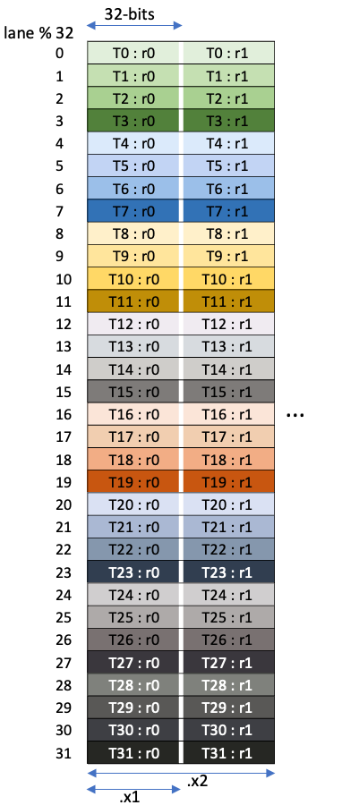
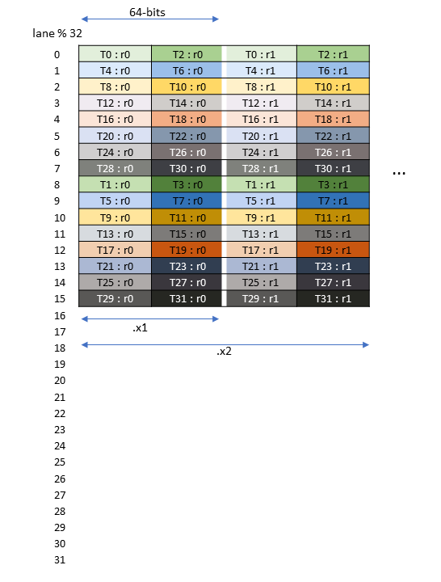
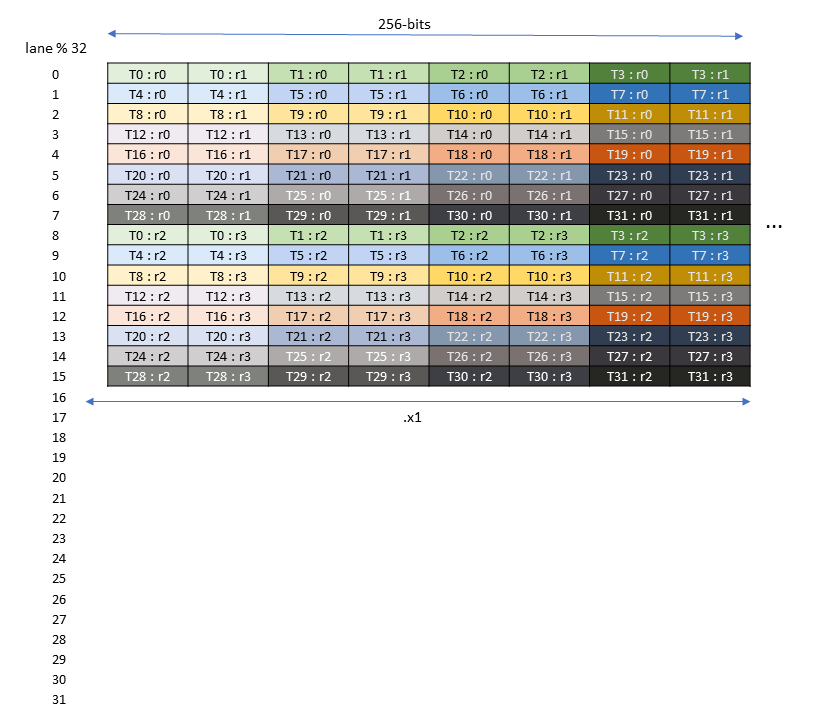
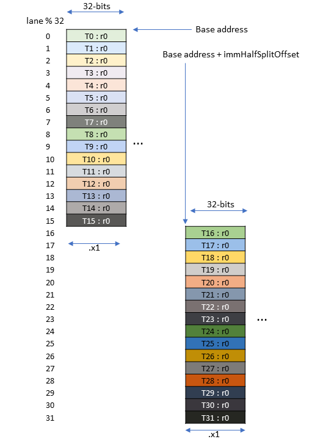

#### 9.7.18.2. Matrix and Data Movement Shape

There are two kinds of shapes involved.

  1. Shapes in the data movement operations

  2. Shapes in the MMA operations

##### 9.7.18.2.1. Matrix Shape

The matrix multiply and accumulate operations support a limited set of shapes for the operand matrices `A`, `B` and `D`. The shapes of all three matrix operands are collectively described by the tuple _MxNxK_ where `A` is _MxK_ matrix, `B` is a _KxN_ matrix, and `D` is a _MxN_ matrix.

Table 48 shows matrix shapes that are supported for the specified types for the `tcgen05.mma` operation.

Table 48 Various combinations of .kind and shapes Various Combinations | Shapes Supported  
---|---  
.kind::* | Has .ws | CTA Group | Sparsity | dtype | atype/btype  
`kind::f16` | No `.ws` | 1 | Dense | `.f16` | `.f16` | 64xNxK 128xNxK | N = {8, 16, 24, … 256} steps of 8 | K = 16  
`.f32` | `.f16`, `.bf16`  
Sparse | `.f16` | `.f16` | K = 32  
`.f32` | `.f16`, `.bf16`  
2 | Dense | `.f16` | `.f16` | 128xNxK 256xNxK | N = {16, 32, … 256} steps of 16 | K = 16  
`.f32` | `.f16`, `.bf16`  
Sparse | `.f16` | `.f16` | K = 32  
`.f32` | `.f16`, `.bf16`  
`.ws` | 1 | Dense | `.f16` | `.f16` | 32xNxK 64xNxK 128xNxK | N = {64, 128, 256} | K = 16  
`.f32` | `.f16`, `.bf16`  
Sparse | `.f16` | `.f16` | N = {64, 128} | K = 32  
`.f32` | `.f16`, `.bf16`  
2 | Either | `.f16` | `.f16` | Invalid  
`.f32` | `.f16`, `.bf16`  
`.kind::tf32` | No `.ws` | 1 | Dense | `.f32` | `.tf32` | 64xNxK 128xNxK | N = {8, 16, 24, … 256} steps of 8 | K = 8  
Sparse | K = 16  
2 | Dense | 128xNxK 256xNxK | N = {16, 32, … 256} steps of 16 | K = 8  
Sparse | K = 16  
`.ws` | 1 | Dense | 32xNxK 64xNxK 128xNxK | N = {64, 128, 256} | K = 8  
Sparse | N = {64, 128} | K = 16  
2 | Dense | Invalid  
Sparse  
`.kind::f8f6f4` | No `.ws` | 1 | Dense | `.f32` `.f16` | `.e4m3`, `.e5m2`, `.e2m3`, `.e3m2`, `.e2m1`

  * For K = 64, only `.e4m3` and `.e5m2` are supported.

| 64xNxK 128xNxK 128xNxK1 | N = {8, 16, … 256} steps of 8 OR N = {16, 32, … 256} steps of 16 | K = 32 K1 = 64  
Sparse | K = 64 / 128  
2 | Dense | 128xNxK 256xNxK 256xNxK1 | N = {16, 32, … 256} steps of 16 | K = 32 K1 = 64  
Sparse | K = 64 / 128  
`.ws` | 1 | Dense | 32xNxK 64xNxK 128xNxK | N = {64, 128, 256} | K = 32 / 64  
Sparse | N = {64, 128} | K = 64 / 128  
2 | Dense | Invalid  
Sparse  
`.kind::mxf8f6f4` | No `.ws` | 1 | Dense | `.f32` | `.e4m3`, `.e5m2`, `.e2m3`, `.e3m2`, `.e2m1` X (Scale) `.ue8m0` | 128xNxK | N = {8, 16, … 256} steps of 8 | K = 32 / 64  
Sparse | K = 64 / 128  
2 | Dense | 128xNxK 256xNxK 256xNxK1 | N = {16, 32, … 256} steps of 16 | K = 32, K1 = 64  
Sparse | 256xNxK | K = 64 / 128  
`.ws` | 1 | Dense | Invalid  
Sparse  
2 | Dense  
Sparse  
`.kind::i8` | No `.ws` | 1 | Dense | `.s32` | `.s8`, `.u8` | 64xNxK 128xNxK | N = {8, 16, 24, 32, 48, … 256} steps of 16 after N > 32 | K = 32  
Sparse | K = 64  
2 | Dense | 128xNxK 256xNxK | N = {32, 64, … 256} steps of 32 | K = 32  
Sparse | K = 64  
`.ws` | 1 | Dense | 32xNxK 64xNxK 128xNxK | N = {64, 128, 256} | K = 32  
Sparse | N = {64, 128} | K = 64  
2 | Dense | Invalid  
Sparse  
`.kind::mxf4` | No `.ws` | 1 | Dense | `.f32` | `.e2m1` X (Scale) `.ue8m0` | 128xNxK | N = {8, 16, … 256} steps of 8 | K = 64 / 96  
Sparse | K = 128 / 192  
2 | Dense | 128xNxK 256xNxK 256xNxK1 | N = {16, 32, … 256} steps of 16 | K = 64, K1 = 96 / 128  
Sparse | 256xNxK | K = 128 / 192  
`.ws` | 1 / 2 | Either | Invalid  
`.kind::mxf4nvf4` | No `.ws` | 1 | Dense | `.f32` | `.e2m1` X (Scale) `.ue8m0`, `.ue4m3`, `.ue5m3` | 128xNxK | N = {8, 16, … 256} steps of 8 | K = 64 / 96  
Sparse | K = 128 / 192  
2 | Dense | 128xNxK 256xNxK 256xNxK1 | N = {16, 32, … 256} steps of 16 | K = 64, K1 = 96 / 128  
Sparse | 256xNxK | K = 128 / 192  
`.ws` | 1 / 2 | Either | Invalid  
`.kind::ti16` | No `.ws` | 1 | Dense | `.s32` | `.s1z4m11` | 64xN1 xK 128xN2 xK | N1 = {8, 16, 24, … 256} steps of 8 N2 = {16, 32, … 256} steps of 16 | K = 16  
Sparse | K = 32  
2 | Dense | 128xNxK 256xNxK | N = {32, 64, … 256} steps of 32 | K = 16  
Sparse | K = 32  
`.ws` | 1 | Dense | 32xNxK 64xNxK 128xNxK | N = {64, 128, 256} | K = 16  
Sparse | N = {64, 128} | K = 32  
2 | Dense | Invalid  
Sparse  
  
###### 9.7.18.2.1.1. Target ISA Note

  * K = 96 is only supported for following architecture-specific targets:

    * `sm_103a`.

    * `sm_107a`

  * K = 64 for Dense matrix and K = 128 for Sparse matrix with `.kind::f8f6f4`/`.kind::mxf8f6f4` supported on following family-specific architectures:

    * `sm_107f` or higher in the same family

  * K = 128 for Dense matrix and K = 192 for Sparse matrix with `.kind::mxf4`/`.kind::mxf4nvf4` supported on following family-specific architectures:

    * `sm_107f` or higher in the same family

##### 9.7.18.2.2. Specifying Matrix Shape

_M_ and _N_ can be specified in the Instruction descriptor.

_K_ can be specified explicitly if there are multiple values of _K_ supported for a given MMA variant. Otherwise, if _K_ can be uniquely determined as per the Table 48, then the instruction descriptor bit corresponding to _K_ must be set to 0.

##### 9.7.18.2.3. Data Movement Shape

The data movement shape indicates the dimension of the data to be moved to or from the Tensor Memory. These shapes are described as a tuple `lane x size` where:

  * `lane` indicates the number of rows in the Tensor Memory; and

  * `size` indicates the amount of data, in units of bits (b), across the columns in the Tensor Memory.

The following shapes are supported by various tcgen05 operations:

Shape | tcgen05.<op>  
---|---  
`.16x64b`, `.16x128b`, `.16x256b`, `.16x32bx2`, `.32x32b` | `.ld` / `.st`  
`.4x256b`, `.32x128b`, `.64x128b`, `.128x256b`, `.128x128b` | `.cp`  
`.31x256b` (implicit) | `.shift`  
  
###### 9.7.18.2.3.1. Memory Layout

The following shows the layout of the matrix fragments across threads of the warp.

####### 9.7.18.2.3.1.1. Matrix fragments for shape .32x32b

A `tcgen05{.ld,.st}.32x32b` instruction has the following data vector register.

Fragment | Elements (low to high)  
---|---  
A vector expression containing `.num` number of `.b32` registers as mentioned in the Table 59. | r0, r1, …  
  
A warp executing `tcgen05{.ld,.st}.32x32b` will access 32 lanes of the Tensor Memory. It loads from or stores to each of the lane (32 * .num)-bits of data as shown in Figure 186.

Figure 186 Matrix Fragment for shape .32x32b

####### 9.7.18.2.3.1.2. Matrix fragments for shape .16x64b

A `tcgen05{.ld,.st}.16x64b` instruction has the following data vector register.

Fragment | Elements (low to high)  
---|---  
A vector expression containing `.num` number of `.b32` registers as mentioned in the Table 59. | r0, r1, …  
  
A warp executing `tcgen05{.ld,.st}.16x64b` will access 16 lanes of the Tensor Memory. It loads from or stores to each of the lane (64 * .num)-bits of data as shown in Figure 187.

Figure 187 Matrix Fragment for shape .16x64b

####### 9.7.18.2.3.1.3. Matrix fragments for shape .16x128b

A `tcgen05{.ld,.st}.16x128b` instruction has the following data vector register.

Fragment | Elements (low to high)  
---|---  
A vector expression containing `.num` number of `.b32` registers as mentioned in the Table 59. | r0, r1, …  
  
A warp executing `tcgen05{.ld,.st}.16x128b` will access 16 lanes of the Tensor Memory. It loads from or stores to each of the lane (128 * .num)-bits of data as shown in Figure 188.

Figure 188 Matrix Fragment for shape .16x128b

####### 9.7.18.2.3.1.4. Matrix fragments for shape .16x256b

A `tcgen05{.ld,.st}.16x256b` instruction has the following data vector register.

Fragment | Elements (low to high)  
---|---  
A vector expression containing `.num` number of `.b32` registers as mentioned in the Table 59. | r0, r1, r2, r3, …  
  
A warp executing `tcgen05{.ld,.st}.16x256b` will access 16 lanes of the Tensor Memory. It loads from or stores to each of the lane (256 * .num)-bits of data as shown in Figure 189.

Figure 189 Matrix Fragment for shape .16x256b

####### 9.7.18.2.3.1.5. Matrix fragments for shape .16x32bx2

A `tcgen05{.ld,.st}.16x32bx2` instruction has the following data vector register.

Fragment | Elements (low to high)  
---|---  
A vector expression containing `.num` number of `.b32` registers as mentioned in the Table 59. | r0, r1, …  
  
A warp executing `tcgen05{.ld,.st}.16x32bx2` will access 16 lanes of the Tensor Memory. It loads from or stores to each of the lane (32 * .num)-bits of data as shown in Figure 190.

Figure 190 Matrix Fragment for shape .16x32bx2
