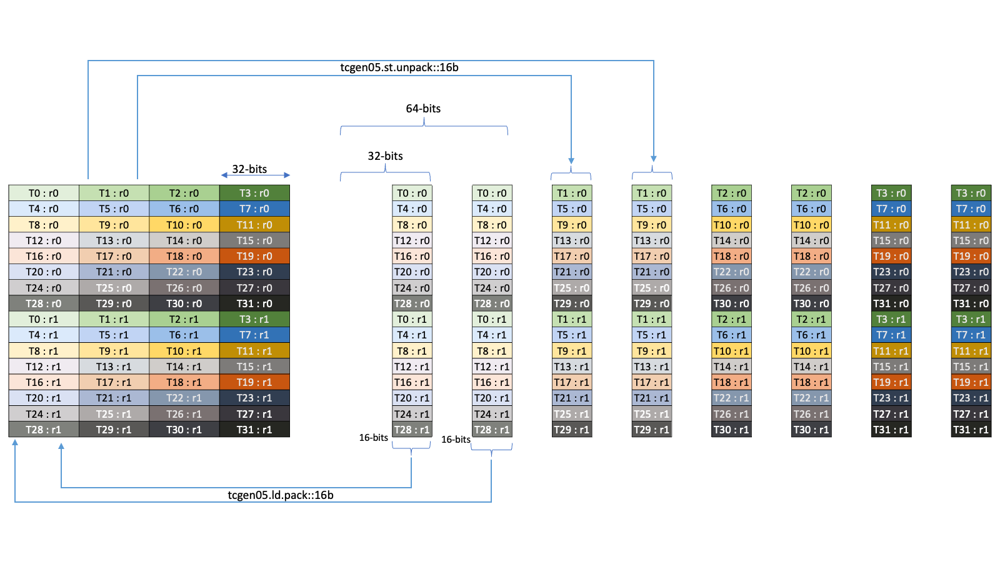

#### 9.7.18.8. Tensor Memory and Register Load/Store Instructions

The threads of the CTA can perform the loads and stores to the Tensor Memory of the CTA and move data between registers and Tensor Memory. The loads and stores of data can be performed in certain shapes as specified in the Matrix and Data Movement Shape section.

##### 9.7.18.8.1. Access restrictions

Not all threads of the CTA can access the entire Tensor Memory via the `tcgen05.ld` and `tcgen05.st` operations.

The Tensor Memory of a CTA is divided into 4 equal chunks such that each warp of a warpgroup in the CTA can access a chunk of the Tensor Memory. All the columns of the Tensor Memory can be accessed by all the four warps of a warpgroup. A lane of the Tensor Memory can be accessed by a single warp in the warpgroup. The following table describes the access restriction.

ID of the warp within the warpgroup | Accessible Lanes  
---|---  
0 | 0-31  
1 | 32-63  
2 | 64-95  
3 | 96-127

##### 9.7.18.8.2. Packing and Unpacking  
  
Optionally, the following pack and unpack operations can be performed during the load and store:

  1. Packing: two 16-bit chunks can be packed into a single 32-bit chunk in the register in `tcgen05.ld`

  2. Unpacking: a single 32-bit chunk in the register can be unpacked into two 16-bit chunks in `tcgen05.st`

as shown in the Figure 196.

Figure 196 Pack/Unpack operations for tcgen05 ld/st

##### 9.7.18.8.3. Tensorcore 5th Generation Instructions: `tcgen05.ld`

`tcgen05.ld`

Asynchronous collective load from tensor memory into registers.

Syntax
    
    
    // Base load instruction:
    
    tcgen05.ld.sync.aligned.shape1.num{.pack}.b32    r, [taddr];
    
    tcgen05.ld.sync.aligned.shape2.num{.pack}.b32    r, [taddr], immHalfSplitoff;
    
    .shape1 = { .16x64b, .16x128b, .16x256b, .32x32b }
    .shape2 = { .16x32bx2 }
    .num    = { .x1, .x2, .x4, .x8, .x16, .x32, .x64, .x128 }
    .pack   = { .pack::16b }
    
    // Floating point type load along with reduction :
    
    tcgen05.ld.red.sync.aligned.shape3.num.redOp{.abs}{.NaN}.f32 r, redval, [taddr];
    
    tcgen05.ld.red.sync.aligned.shape4.num.redOp{.abs}{.NaN}.f32 r, redval, [taddr], immHalfSplitoff;
    
    // Integer type load along with reduction :
    
    tcgen05.ld.red.sync.aligned.shape3.num.redOp.type r, redval, [taddr];
    
    tcgen05.ld.red.sync.aligned.shape4.num.redOp.type r, redval, [taddr], immHalfSplitoff;
    
    .shape3 = { .32x32b   }
    .shape4 = { .16x32bx2 }
    .redOp  = { .min, .max }
    .type   = { .u32, .s32 }
    
    tcgen05.ld.spcompress.sync.aligned.shape.num.rowop.spfactor{.abs}.type.idxsize mdata, cdata, [taddr];
    
    tcgen05.ld.red.spcompress.sync.aligned.shape.num.rowop.spfactor{.abs}{.NaN}.type.idxsize mdata, cdata, redval, [taddr];
    
    .shape    = { .32x32b }
    .rowop    = { .min, .max }
    .type     = { .f32 }
    .idxsize  = { .b2 }
    .spfactor = { .sp::2:4 }
    .num      = { .x4, .x8, .x16, .x32, .x64, .x128 }
    

Description

Instruction `tcgen05.ld` asynchronously loads data from the Tensor Memory at the location specified by the 32-bit address operand `taddr` into the destination register `r`, collectively across all threads of the warps.

All the threads in the warp must specify the same value of `taddr`, which must be the base address of the collective load operation. Otherwise, the behavior is undefined.

The `.shape` qualifier and the `.num` qualifier together determines the total dimension of the data which is loaded from the Tensor Memory. The `.shape` qualifier indicates the base dimension of data to be accessed as described in the Data Movement Shape. The `.num` qualifier indicates the repeat factor on the base dimension resulting in the total dimension of the data that is accessed.

The shape `.16x32bx2` performs two accesses into Tensor Memory of the shape `.16x32b`. The base address of the first access is specified by taddr and the base address of the second access is specified by `taddr+immHalfSplitoff`, where `immHalfSplitoff` is an immediate argument.

The destination operand `r` is a brace-enclosed vector expression consisting of one or more 32-bit registers as per the value of `.shape` and `.num`. The size of the vector for various combinations of `.num` and `.shape` is shown in Table 59.

Table 59 Various-combinations of .num and .shape .num | .shape  
---|---  
.16x32bx2 / .16x64b / .32x32b | .16x128b | .16x256b  
`.x1` | 1 | 2 | 4  
`.x2` | 2 | 4 | 8  
`.x4` | 4 | 8 | 16  
`.x8` | 8 | 16 | 32  
`.x16` | 16 | 32 | 64  
`.x32` | 32 | 64 | 128  
`.x64` | 64 | 128 | NA  
`.x128` | 128 | NA | NA  
  
The qualifier `.red` specifies that the reduction operation specified by `.redOp` is performed on the data that is loaded across columns in each lane. The result of the reduction operation is written into the corresponding thread’s 32-bit destination register operand `redVal`. When `.red` qualifier is specified, `.num` modifier must be at least `.x2`.

If `.abs` qualifier is specified, the absolute values of the loaded data are considered for the reduction operation. If `.NaN` qualifier is specified, the result of the reduction operation is canonical NaN if either of the inputs to the reduction operation is NaN.

When the qualifier `.spcompress` is specified the instruction performs in-line spcompress operation while loading the data from the Tensor Memory. The compression factor is specified by the qualifier `.spfactor`. The only allowed value for `.spfactor` is `.sp::2:4` resulting in 2:4 compression for the data loaded from the Tensor Memory. In this case, half of the data as read from the Tensor Memory is stored to the vector operand `cdata` while corresponding metadata information depicting indices for the chosen elements is stored in the vector operand `mdata`. The size of each data element is given by `.type` and must be `.f32`. The size for the resulting metadata index for each data element is given by `.idxsize` and must always be `.b2`. The `.rowop` along with the optional `.abs` qualifier together specifies the criterion to select the two elements per group of four elements. When the qualifier `.red` is specified along with the `.spcompress` qualifier, the same `.rowop` along with the optional `.abs` qualifier also specifies the reduction operator. However, note that in such cases, if `.NaN` qualifier is specified, it is applicable only to the reduction part of the operation (`.red` portion) and it does not apply to the spcompress part of the operation. This is because fundamentally spcompress operation always preserves the `NaN` in the output. The operands `mdata`, `cdata` are brace-enclosed vector expression consisting of one or more `.b32` registers. The expected vector size for each of the operand can be computed based on the Table 60.

Table 60 Expected vector size for various operands Operand | Vector Size  
---|---  
`mdata` | `ceil(num / 32)`  
`cdata` | `num / 2`  
  
The optional qualifier `.pack::16b` can be used to pack two 16-bit elements from adjacent columns into a single 32-bit element during the load as shown in the section Packing and Unpacking.

The mandatory `.sync` qualifier indicates that `tcgen05.ld` causes the executing thread to wait until all threads in the warp execute the same `tcgen05.ld` instruction before resuming execution.

The mandatory `.aligned` qualifier indicates that all threads in the warp must execute the same `tcgen05.ld` instruction. In conditionally executed code, a `tcgen05.ld` instruction should only be used if it is known that all threads in the warp evaluate the condition identically, otherwise behavior is undefined.

The behavior of `tcgen05.ld` is undefined if all threads do not use the same values of `taddr`, or if any thread in the warp has exited.

The instruction `tcgen05.ld` is performed asynchronously and more details are specified in the section Memory Consistency Model for 5th generation of TensorCore operations.

PTX ISA Notes

Introduced in PTX ISA version 8.6.

`tcgen05.ld.red` is introduced in PTX ISA version 8.8.

`tcgen05.ld{.red}.spcompress` is introduced in PTX ISA version 9.4.

Target ISA Notes

Supported on following architectures:

  * `sm_100a`

  * `sm_101a` (Renamed to `sm_110a` from PTX ISA version 9.0)

  * And is supported on following family-specific architectures from PTX ISA version 8.8:

    * `sm_100f` or higher in the same family

    * `sm_101f` or higher in the same family (Renamed to `sm_110f` from PTX ISA version 9.0)

  * `sm_110f` or higher in the same family

`tcgen05.ld.red` is supported on following architectures:

  * `sm_101a` (Renamed to `sm_110a` from PTX ISA version 9.0)

  * And is supported on following family-specific architectures from PTX ISA version 8.8:

    * `sm_101f` or higher in the same family (Renamed to `sm_110f` from PTX ISA version 9.0)

    * `sm_103f` or higher in the same family

  * `sm_110f` or higher in the same family

`tcgen05.ld{.red}.spcompress` is supported on following architectures:

  * `sm_107a`

Examples
    
    
    tcgen05.ld.sync.aligned.32x32b.x2.b32     {r0, r1}, [taddr1];
    
    tcgen05.ld.sync.aligned.16x128b.x4.b32    {r0, r1, r2, r3, r4, r5, r6, r7}, [taddr2];
    
    tcgen05.ld.red.sync.aligned.16x32bx2.x8.u32.max {r0, r1, r2, r3, r4, r5, r6, r7},
                                                     redVal, [taddr3], 16;
    tcgen05.ld.red.spcompress.sync.aligned.32x32b.x32.max.sp::2:4.abs.f32.b2
                                              {mdata_0}, {r0, r1, r2, r3, r4, r5, r6, r7, r8, r9, r10, r11, r12, r13, r14, r15},
                                              redval, [taddr];
    

##### 9.7.18.8.4. Tensorcore 5th Generation Instructions: `tcgen05.st`

`tcgen05.st`

Asynchronous collective store to tensor memory from registers.

Syntax
    
    
    tcgen05.st.sync.aligned.shape1.num{.unpack}.b32    [taddr], r;
    
    tcgen05.st.sync.aligned.shape2.num{.unpack}.b32    [taddr], immHalfSplitoff, r;
    
    .shape1 = { .16x64b, .16x128b, .16x256b, .32x32b }
    .shape2 = { .16x32bx2 }
    .num    = { .x1, .x2, .x4, .x8, .x16, .x32, .x64, .x128 }
    .unpack = { .unpack::16b }
    

Description

Instruction `tcgen05.st` asynchronously stores data from the source register `r` into the Tensor Memory at the location specified by the 32-bit address operand `taddr`, collectively across all threads of the warps.

All the threads in the warp must specify the same value of `taddr`, which must be the base address of the collective store operation. Otherwise, the behavior is undefined.

The `.shape` qualifier and the `.num` qualifier together determines the total dimension of the data which is stored to the Tensor Memory. The `.shape` qualifier indicates the base dimension of data to be accessed as described in the Data Movement Shape. The `.num` qualifier indicates the repeat factor on the base dimension resulting in the total dimension of the data that is accessed.

The shape `.16x32bx2` performs two accesses into Tensor Memory of the shape `.16x32b`. The base address of the first access is specified by `taddr` and the base address of the second access is specified by `taddr+immHalfSplitoff`, where `immHalfSplitoff` is an immediate argument.

The source operand `r` is a brace-enclosed vector expression consisting of one or more 32-bit registers as per the value of `.shape` and `.num`. The size of the vector for various combinations of `.num` and `.shape` is shown in Table 61.

Table 61 Various-combinations of .num and .shape .num | .shape  
---|---  
.16x32bx2 / .16x64b / .32x32b | .16x128b | .16x256b  
`.x1` | 1 | 2 | 4  
`.x2` | 2 | 4 | 8  
`.x4` | 4 | 8 | 16  
`.x8` | 8 | 16 | 32  
`.x16` | 16 | 32 | 64  
`.x32` | 32 | 64 | 128  
`.x64` | 64 | 128 | NA  
`.x128` | 128 | NA | NA  
  
The optional qualifier `.unpack::16b` can be used to unpack a 32-bit element in the register into two 16-bit elements and store them in adjacent columns as shown in the section Packing and Unpacking.

The mandatory `.sync` qualifier indicates that `tcgen05.st` causes the executing thread to wait until all threads in the warp execute the same `tcgen05.st` instruction before resuming execution.

The mandatory `.aligned` qualifier indicates that all threads in the warp must execute the same `tcgen05.st` instruction. In conditionally executed code, a `tcgen05.st` instruction should only be used if it is known that all threads in the warp evaluate the condition identically, otherwise behavior is undefined.

The behavior of `tcgen05.st` is undefined if all threads do not use the same values of `taddr`, or if any thread in the warp has exited.

The instruction `tcgen05.st` is performed asynchronously and more details are specified in the section Memory Consistency Model for 5th generation of TensorCore operations.

PTX ISA Notes

Introduced in PTX ISA version 8.6.

Target ISA Notes

Supported on following architectures:

  * `sm_100a`

  * `sm_101a` (Renamed to `sm_110a` from PTX ISA version 9.0)

  * And is supported on following family-specific architectures from PTX ISA version 8.8:

    * `sm_100f` or higher in the same family

    * `sm_101f` or higher in the same family (Renamed to `sm_110f` from PTX ISA version 9.0)

  * `sm_110f` or higher in the same family

Examples
    
    
    tcgen05.st.sync.aligned.16x64b.x4.b32               [taddr0], {r0,  r1,  r2,  r3};
    
    tcgen05.st.sync.aligned.16x128b.x1.unpack::16b.b32  [taddr1], {r0,  r1};
    

##### 9.7.18.8.5. Tensorcore 5th Generation Instructions: `tcgen05.wait`

`tcgen05.wait`

Waits for the completion of all prior asynchronous `tcgen05.ld` / `tcgen05.st` instructions.

Syntax
    
    
    tcgen05.wait_operation.sync.aligned;
    
    .wait_operation = { .wait::ld, .wait::st }
    

Description

Instruction `tcgen05.wait::st` causes the executing thread to block until all prior `tcgen05.st` operations issued by the executing thread have completed.

Instruction `tcgen05.wait::ld` causes the executing thread to block until all prior `tcgen05.ld` operations issued by the executing thread have completed.

The mandatory `.sync` qualifier indicates that `tcgen05.wait_operation` causes the executing thread to wait until all threads in the warp execute the same `tcgen05.wait_operation` instruction before resuming execution.

The mandatory `.aligned` qualifier indicates that all threads in the warp must execute the same `tcgen05.wait_operation` instruction.

PTX ISA Notes

Introduced in PTX ISA version 8.6.

Target ISA Notes

Supported on following architectures:

  * `sm_100a`

  * `sm_101a` (Renamed to `sm_110a` from PTX ISA version 9.0)

  * And is supported on following family-specific architectures from PTX ISA version 8.8:

    * `sm_100f` or higher in the same family

    * `sm_101f` or higher in the same family (Renamed to `sm_110f` from PTX ISA version 9.0)

  * `sm_110f` or higher in the same family

Examples
    
    
    Example 1:
    
    tcgen05.ld.sync.aligned.32x32b.x2.b32     {r0, r1}, [taddr0];
    
    // Prevents subsequent tcgen05.mma from racing ahead of the tcgen05.ld
    
    tcgen05.wait::ld.sync.aligned;
    
    tcgen05.mma.cta_group::1.kind::f16   [taddr0],  a-desc,  b-desc, idesc, p;
    
    Example 2:
    
    tcgen05.st.sync.aligned.32x32b.x2.b32     [taddr0], {r0, r1};
    
    // Prevents the write to taddr0 in tcgen05.mma from racing ahead of the tcgen05.st
    
    tcgen05.wait::st.sync.aligned;
    
    tcgen05.mma.cta_group::1.kind::f16   [taddr0],  a-desc,  b-desc, idesc, p;
